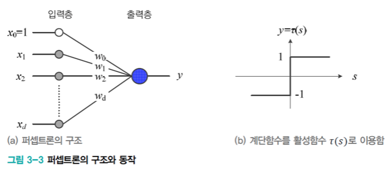
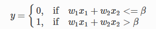
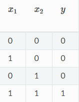
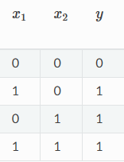
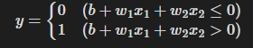
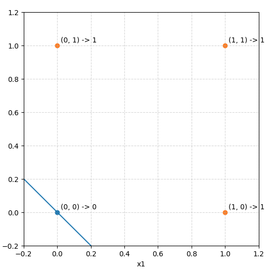

## 2-1. 퍼셉트론이란?

다수의 신호를 입력으로 받아 하나의 0 또는 1의 신호를 출력하는 가장 기초적인 인공신경망 알고리즘이다



퍼셉트론의 동작 원리를 수식으로 나타냄


임계값을 넘으면 1을 출력한다 여기서 임계값은 베타이다

## 2-2. 단순한 논리 회로

AND게이트                                            OR게이트                                                    NAND게이트

                                                      

## 2-3. 퍼셉트론 구현하기

and 게이트 구현
```python
def AND (x1, x2):

w1, w2, theta = 0.5, 0.5, 0.7

tmp = w1*x1 + w2*x2

if tmp <= theta:

return 0

elif tmp > theta:

return 1
```

## 2-4. 가중치와 편향 도입



기존의 세타를 이항하여 우변을 0으로 만들면 퍼셉트론의 동작이 위의 식처럼 된다

w1과 w2는 그대로 가중치의 역할을 하고 b는 편향이라한다. 퍼셉트론은 입력신호에 가중치를 곱한 값과 편향을 합하여, 그 값이 0을 넘으면 1을 출력하고 그렇지 않으면 0을 출력한다

```python
import numpy as np

  

x = np.array([0, 1])

w = np.array([0.5, 0.5])

b = -0.7

  

print(w*x)

print(np.sum(w*x))

print(np.sum(w*x) + b)
```

## 2-4. 퍼셉트론의 한계

현재까지의 퍼셉트론으로는 한계가 있다 그 문제는 XOR게이트를 만드는 과정에서 발생하게 된다

우선 이전에 만든 OR게이트의 동작을 시각화하게된다면 아래와 같아진다

  

현재
