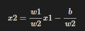
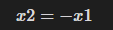
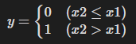
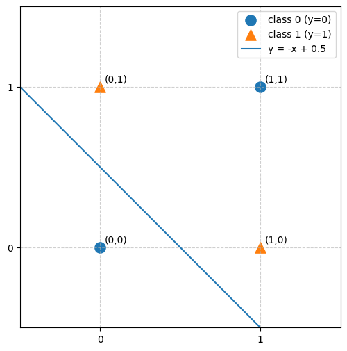
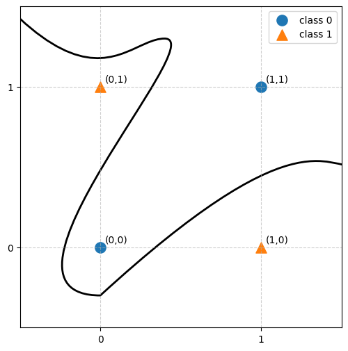
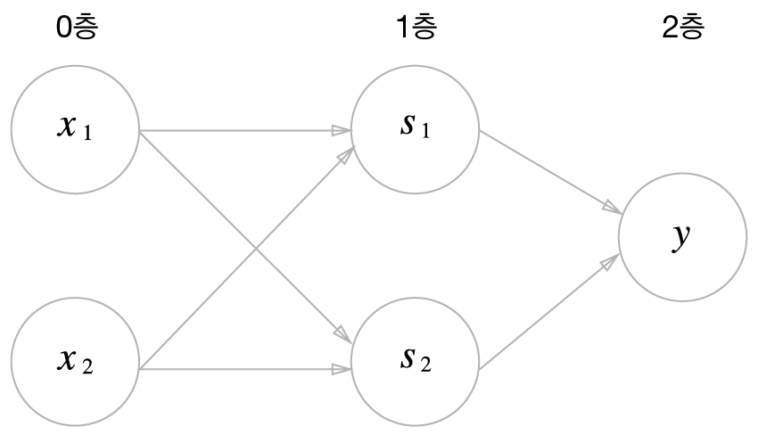

## 2-1. 퍼셉트론이란?

다수의 신호를 입력으로 받아 하나의 0 또는 1의 신호를 출력하는 가장 기초적인 인공신경망 알고리즘이다


퍼셉트론의 동작 원리를 수식으로 나타냄


임계값을 넘으면 1을 출력한다 여기서 임계값은 베타이다

## 2-2. 단순한 논리 회로

AND게이트                                            OR게이트                                                    NAND게이트

                                                      

## 2-3. 퍼셉트론 구현하기

and 게이트 구현
```python
def AND (x1, x2):

w1, w2, theta = 0.5, 0.5, 0.7

tmp = w1*x1 + w2*x2

if tmp <= theta:

return 0

elif tmp > theta:

return 1
```

## 2-4. 가중치와 편향 도입


기존의 세타를 이항하여 우변을 0으로 만들면 퍼셉트론의 동작이 위의 식처럼 된다

w1과 w2는 그대로 가중치의 역할을 하고 b는 편향이라한다. 퍼셉트론은 입력신호에 가중치를 곱한 값과 편향을 합하여, 그 값이 0을 넘으면 1을 출력하고 그렇지 않으면 0을 출력한다

```python
import numpy as np

  

x = np.array([0, 1])

w = np.array([0.5, 0.5])

b = -0.7

  

print(w*x)

print(np.sum(w*x))

print(np.sum(w*x) + b)
```

## 2-5. 퍼셉트론의 한계

현재까지의 퍼셉트론으로는 한계가 있다 그 문제는 XOR게이트를 만드는 과정에서 발생하게 된다

우선 이전에 만든 OR게이트의 동작을 시각화하게된다면 아래와 같아진다

  

x축을 x1, y축을 x2라고 나타낸다고 하면, 이 평면 위에 다음과 같은 그래프가 그려지게된다

주어진 값을 해당 함수에 대입하면 다음과 같은 결과가 나타난다



현재 주어진 그래프를 살펴보면 y = -x 그래프가 그려진 것을 확인할 수 있다
이것이 무슨 상관인가 생각해본다면 구현한 OR 게이트를 대입하여 살펴보면된다



주어진 각 지점에 대하여, 직선 아래에 있는 지점은 0을 출력하고, 직선 위에 있는 지점은 1을 출력하는 형태의 구조가 완성된다.

즉, 위 퍼셉트론은 하나의 직선을 기준으로 평면을 두 공간으로 나누고, 서로 다른 두 공간에 대하여 서로 다른 출력을 내놓게 만드는 것이다

이를 XOR게이트에 대입해서 구현해보려하면



위에서 퍼셉트론에 대한 시각화를 시도한 덕분에, 직관적으로 하나의 직선으로 구분하기는 어렵다는 것을 파악할 수 있다.

```text
이와 같은 접근을 "선형 분리"라고한다
```

## 2-6. 선형과 비선형

방금의 고찰로 직선 형태로는 XOR을 구현하기는 어렵다는 것을 알 수 있었다.



만약 이런식으로 곡선을 그린다면, 판단이 정확한것 같은데, 퍼셉트론으로 곡선을 그릴수는 없을까? 라는 고뇌에서 오는 개념은 다층 퍼셉트론이다.

## 2-7. 게이트 조립하기

기존의 직선형태의 단층 퍼셉트론으로는 XOR게이트를 만들기는 불가능하다는것을 알았다

컴퓨터공학의 디지털 논리회로에서 NAND게이트로 각종 다른 게이트들을 만드는것처럼 OR, AND, NAND연산을 이용하여 XOR게이트를 구현하면 아래와 같은 코드가 된다

```python
def XOR(x1, x2):

s1 = NAND(x1, x2)

s2 = OR(x1, x2)

y = AND(s1, s2)

return y
```

XOR은 아래와 같은 다층 구조가 될것이고 이것을 다층 퍼셉트론이라고한다.



## 내 생각

인공지능도 다른 학문과 크게 다르지 않게 발전해온것같다. 방금 공부한 단층 퍼셉트론에서 다층 퍼셉트론으로 발전한것처럼 필요에 의해서 문제가 생김에 따라 발전한 모습은 여타 다른 학문들과의 큰 차이점은 없는것같다.  다만 최근에 너무 큰 파장이 불어온것같고 그 파장에 
계단 함수처럼 0 아니면 1로 끊기는 출력이라면 가중치를 조금 바꿨을 때 결과가 얼마나 좋아지는지 알기 어렵지않을까? 그렇다면 가중치를 어떻게 자동으로 찾는지 궁금증이 남는다
