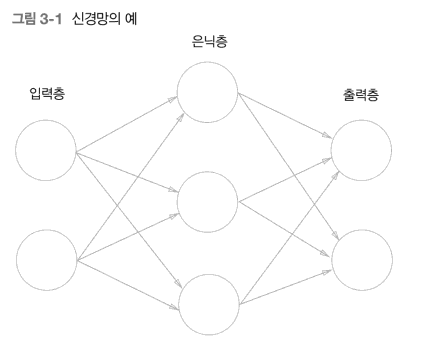

## 3 - 1. 퍼셉트론에서 신경망으로

퍼셉트론은 복잡한 함수도 표현할 수 있지만 가중치를 설정하는 작업은 여전히 사람이 수동으로 한다는 단점이 존재한다. 하지만 신경망은 가중치 매개변수의 적절한 값을 데이터로부터 자동으로 학습하는 능력을 갖추고 있다

왼쪽 줄을 입력층, 중간 줄을 은닉층, 오른쪽 줄을 출력층이라고 한다

은닉층이라 부르는 이유는 사람의 눈에 직접적으로 보이지 않는 부분이기 때문이다

위에 그림 3-1은 앞 장에서 본 퍼셉트론과 크게 달라 보이지 않는다. 실제로 뉴런의 연결 방식은 달라진것이 없다 다만 신호를 전달하는 방법에서 차이가 발생한다.

## 3 - 2. 활성화 함수

활성화 함수란 입력 신호의 총합이 활성화를 일으키는지를 정하는 역할을 한다. 활성화 함수가 필요한 이유는 모델의 복잡도를 올리기 위함인데 비선형 문제를 해결하는데 중요한 역할을 한다,
비선형 문제를 해결하기 위해 단층 퍼셉트론을 쌓는 방법을 이용헀는데 은닉층을 무작정 쌓기만 한다고해서 비선형문제를 해결할 수 있는것은 아니다. 활성 함수를 사용하면 입력값에 대한 출력값이 비선형적으로 나오므로 선형분류기를 비선형분류기로도 만들 수 있다.

## 3 - 2 - 1. 시그모이드 함수

신경망에서는 가중치를 학습시키는데 있어 미분을 사용해야했기 때문에 활성화 함수로 계단함수를 사용할 수 없었다. 또한 계단함수는 0과 1과 같은 극단적인 값을 전달하기 때문에 데이터의 정보를 손실시켰다, 따라서 계단함수를 곡선의 형태로 변형시킨 형태의 시그모이드 함수를 적용하게 되었다. 시그모이드는 우리가 흔히 알고 있는 로지스틱 함수이다.

## 3 - 2 - 2. 함수 구현하기
