4장에서는 신경망의 가중치 매개변수에 대한 손실 함수의 기울기를 수치 미분으로 구했다. 수치 미분은 단순하고 구현하기 쉽지만 매개변수 하나마다 순전파를 두 번씩 해야 해서 계산 시간이 오래 걸린다. 이번 장에서는 가중치 매개변수의 기울기를 효율적으로 계산하는 오차역전파법(backpropagation)을 다룬다.

오차역전파법을 이해하는 방법은 수식을 통한 방법과 계산 그래프를 통한 방법 두 가지가 있다. 책에서는 계산 그래프를 이용해 시각적으로 이해하는 방법을 사용한다.

## 5 - 1. 계산 그래프

계산 그래프(computational graph)는 계산 과정을 그래프로 나타낸 것이다. 그래프는 노드(node)와 에지(edge)로 표현되는데, 노드는 연산을 나타내는 원이고 에지는 노드 사이를 잇는 화살표로 그 위로 계산 결과가 흐른다.

### 5 - 1 - 1. 계산 그래프로 풀다

**문제 1** : 슈퍼에서 1개에 100원인 사과를 2개 샀다. 이때 지불 금액을 구하라. 단, 소비세가 10% 부과된다.

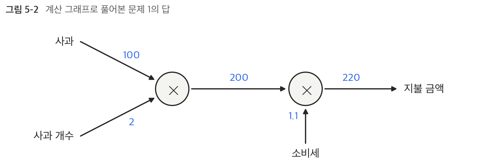

사과의 100원이 × 노드로 흘러가 사과 개수 2와 곱해져 200원이 되고, 다시 소비세 1.1과 곱해져 최종 금액 220원이 된다. 노드 안에 ×2, ×1.1처럼 숫자를 같이 적을 수도 있지만 사과의 개수와 소비세도 변수로 보고 원 밖에 적는 것이 더 일반적이다.

**문제 2** : 슈퍼에서 사과를 2개, 귤을 3개 샀다. 사과는 1개에 100원, 귤은 1개에 150원이다. 소비세가 10%일 때 지불 금액을 구하라.

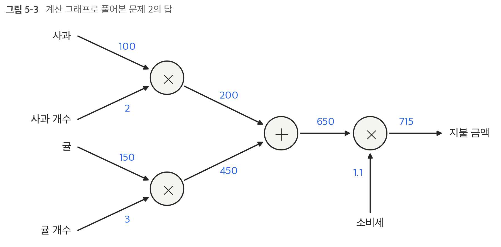

덧셈 노드(+)가 새로 등장해서 사과와 귤의 금액을 합산한다. 계산 그래프를 이용한 문제풀이는 다음 흐름으로 진행된다.

1) 계산 그래프를 구성한다
2) 그래프에서 계산을 왼쪽에서 오른쪽으로 진행한다

-> 이처럼 계산을 왼쪽에서 오른쪽으로 진행하는 단계를 **순전파**(forward propagation)라고 한다. 반대로 오른쪽에서 왼쪽으로 진행하는 것은 **역전파**(backward propagation)라고 하며, 미분을 계산할 때 중요한 역할을 한다.

### 5 - 1 - 2. 국소적 계산

계산 그래프의 특징은 '국소적 계산'을 전파함으로써 최종 결과를 얻는다는 점이다. 국소적이란 '자신과 직접 관계된 작은 범위'라는 뜻으로, 전체에서 어떤 일이 벌어지든 상관없이 자신과 관계된 정보만으로 결과를 출력할 수 있다는 것이다.

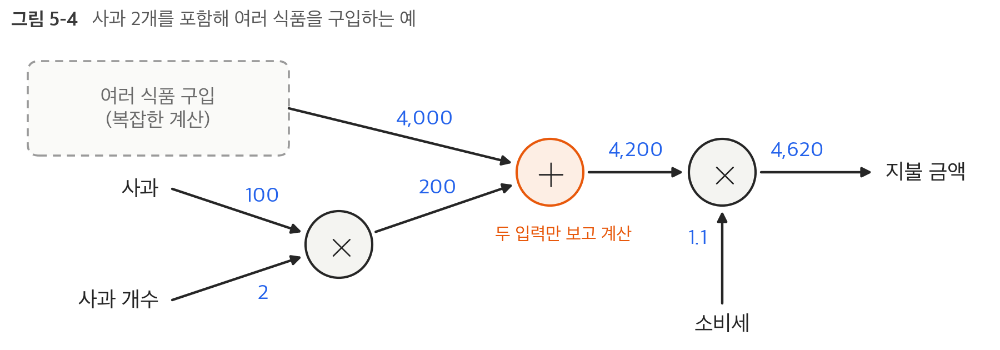

여러 식품을 구입하는 계산이 아무리 복잡해도 + 노드는 들어온 두 숫자(4,000과 200)를 더해서 내보내기만 하면 된다. 각 노드는 자신과 관련한 계산 외에는 신경 쓸 게 없다. 전체 계산이 복잡하더라도 각 단계에서 하는 일은 단순하고, 이 단순한 계산들이 모여서 복잡한 계산을 해낸다. 자동차 조립 라인에서 작업자 각자가 자기가 맡은 단순한 일만 하는 것과 비슷하다.

### 5 - 1 - 3. 왜 계산 그래프로 푸는가?

계산 그래프의 이점은 다음과 같다

- 국소적 계산 : 전체가 아무리 복잡해도 각 노드에서는 단순한 계산에 집중하여 문제를 단순화할 수 있다
- 중간 계산 결과를 모두 보관할 수 있다 (사과 2개까지 계산한 200원, 소비세를 붙이기 전의 650원 등)
- **역전파를 통해 미분을 효율적으로 계산할 수 있다** ← 가장 큰 이유

문제 1에서 사과 가격이 오르면 최종 금액에 어떤 영향을 끼치는지 알고 싶다고 하자. 이는 '사과 가격에 대한 지불 금액의 미분'을 구하는 문제이다. 사과 값을 $x$, 지불 금액을 $L$이라 하면 $\frac{\partial L}{\partial x}$를 구하는 것이고, 이 값은 사과 값이 아주 조금 올랐을 때 지불 금액이 얼마나 증가하는지를 나타낸다.

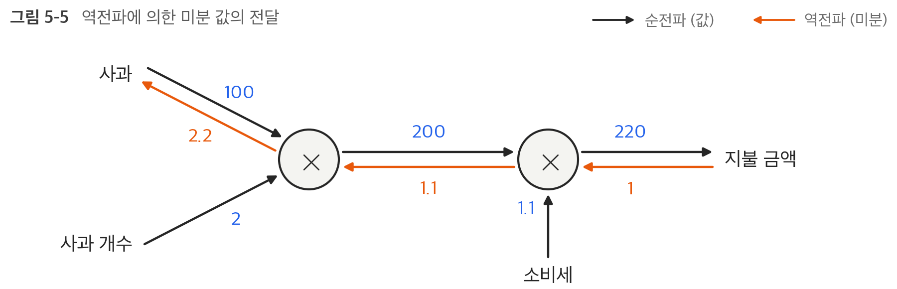

역전파는 순전파와 반대 방향의 화살표(주황색)로 그린다. 오른쪽 끝에서 1로 시작해서 국소적 미분을 곱하며 1 → 1.1 → 2.2 순으로 전달되고, 사과 가격에 대한 지불 금액의 미분 값은 2.2가 된다. 즉 사과 가격이 1원 오르면 최종 금액은 2.2원 오른다.

여기서는 사과 가격에 대한 미분만 구했지만 소비세나 사과 개수에 대한 미분도 같은 순서로 구할 수 있다. 이때 중간까지 구한 미분 결과를 공유할 수 있어서 여러 개의 미분을 효율적으로 계산할 수 있다. 결국 계산 그래프의 이점은 순전파와 역전파를 활용해서 각 변수의 미분을 효율적으로 구할 수 있다는 것이다.

## 5 - 2. 연쇄법칙

역전파는 '국소적인 미분'을 순방향과는 반대인 오른쪽에서 왼쪽으로 전달한다. 이 국소적 미분을 전달하는 원리는 연쇄법칙(chain rule)에 따른 것이다.

### 5 - 2 - 1. 계산 그래프의 역전파

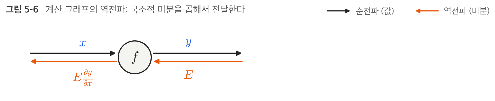

$y = f(x)$라는 계산의 역전파는 상류(오른쪽)에서 전달된 신호 $E$에 노드의 국소적 미분 $\frac{\partial y}{\partial x}$를 곱한 후 다음 노드(왼쪽)로 전달하는 것이다. 국소적 미분은 순전파 때의 $y = f(x)$ 계산의 미분을 구한다는 뜻이다. 예를 들어 $y = f(x) = x^2$이라면 $\frac{\partial y}{\partial x} = 2x$가 되고, 상류에서 온 $E$에 $2x$를 곱해서 앞쪽 노드로 보낸다.

이 방식을 따르면 목표로 하는 미분 값을 효율적으로 구할 수 있는데, 그 이유는 연쇄법칙에 있다.

### 5 - 2 - 2. 연쇄법칙이란?

합성 함수란 여러 함수로 구성된 함수이다. 예를 들어 $z = (x + y)^2$은 다음 두 개의 식으로 구성된다.

$$
z = t^2, \qquad t = x + y
$$

연쇄법칙은 합성 함수의 미분에 대한 성질이며 다음과 같다.

```text
합성 함수의 미분은 합성 함수를 구성하는 각 함수의 미분의 곱으로 나타낼 수 있다
```

$$
\frac{\partial z}{\partial x} = \frac{\partial z}{\partial t}\frac{\partial t}{\partial x}
$$

$\partial t$를 서로 지울 수 있다고 생각하면 기억하기 쉽다. 국소적 미분(편미분)을 각각 구하면

$$
\frac{\partial z}{\partial t} = 2t, \qquad \frac{\partial t}{\partial x} = 1
$$

이고, 둘을 곱하면 최종적으로 구하고 싶은 $x$에 대한 $z$의 미분이 나온다.

$$
\frac{\partial z}{\partial x} = \frac{\partial z}{\partial t}\frac{\partial t}{\partial x} = 2t \cdot 1 = 2(x + y)
$$

### 5 - 2 - 3. 연쇄법칙과 계산 그래프

위의 연쇄법칙 계산을 계산 그래프로 나타내면 다음과 같다. `**2` 노드는 제곱 계산을 뜻한다.

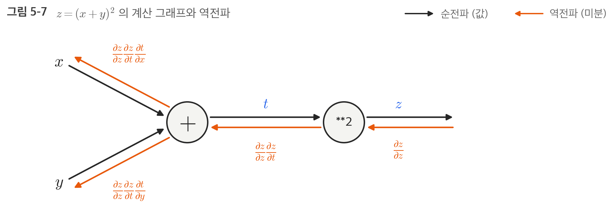

오른쪽 끝에서 시작한 역전파는 국소적 미분을 곱하면서 왼쪽으로 전달된다. 맨 왼쪽 $x$에 도착한 값을 정리하면

$$
\frac{\partial z}{\partial z}\frac{\partial z}{\partial t}\frac{\partial t}{\partial x} = \frac{\partial z}{\partial t}\frac{\partial t}{\partial x} = \frac{\partial z}{\partial x}
$$

로 연쇄법칙에 따라 '$x$에 대한 $z$의 미분'이 된다. 즉 **역전파가 하는 일은 연쇄법칙의 원리와 같다**. 위에서 구한 값을 대입하면 $\frac{\partial z}{\partial x} = 2(x + y)$가 나온다.

## 5 - 3. 역전파

### 5 - 3 - 1. 덧셈 노드의 역전파

$z = x + y$라는 식을 미분하면 다음과 같다.

$$
\frac{\partial z}{\partial x} = 1, \qquad \frac{\partial z}{\partial y} = 1
$$

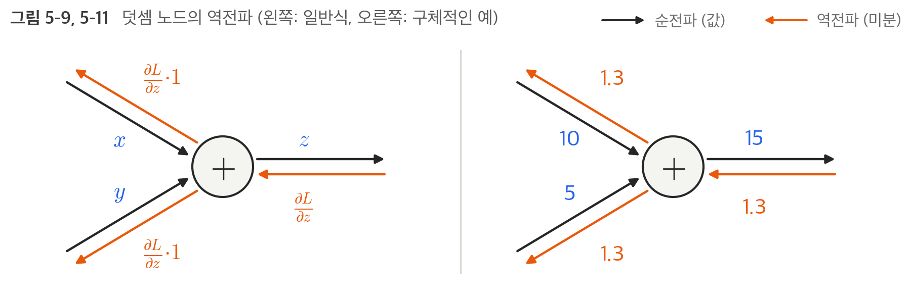

이 노드가 최종적으로 $L$을 출력하는 큰 계산 그래프의 일부라고 하면 상류에서 $\frac{\partial L}{\partial z}$가 전해진다. 덧셈 노드의 역전파는 여기에 1을 곱하기만 하므로 **입력된 값을 그대로 다음 노드로 보낸다**. 오른쪽 예처럼 10 + 5 = 15이고 상류에서 1.3이 흘러오면 $x$ 쪽과 $y$ 쪽 모두 1.3을 그대로 보낸다.

### 5 - 3 - 2. 곱셈 노드의 역전파

$z = xy$라는 식의 미분은 다음과 같다.

$$
\frac{\partial z}{\partial x} = y, \qquad \frac{\partial z}{\partial y} = x
$$

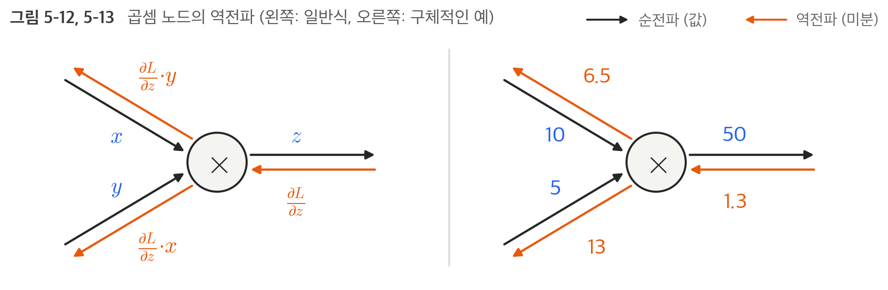

곱셈 노드의 역전파는 상류의 값에 **순전파 때의 입력 신호들을 서로 바꾼 값**을 곱해서 하류로 보낸다. $x$ 쪽에는 $y$를, $y$ 쪽에는 $x$를 곱하는 것이다. 오른쪽 예처럼 10 × 5 = 50이고 상류에서 1.3이 오면 $x$ 쪽은 1.3 × 5 = 6.5, $y$ 쪽은 1.3 × 10 = 13이 된다.

덧셈의 역전파는 상류의 값을 그대로 흘려보내서 순방향 입력 신호의 값이 필요하지 않았지만, 곱셈의 역전파는 순방향 입력 신호의 값이 필요하다. 그래서 곱셈 노드를 구현할 때는 순전파의 입력 신호를 변수에 저장해 둔다.

|  | 덧셈 노드 | 곱셈 노드 |
| --- | --- | --- |
| 순전파 | $z = x + y$ | $z = xy$ |
| $x$ 쪽으로 보내는 값 | $\frac{\partial L}{\partial z} \cdot 1$ | $\frac{\partial L}{\partial z} \cdot y$ |
| $y$ 쪽으로 보내는 값 | $\frac{\partial L}{\partial z} \cdot 1$ | $\frac{\partial L}{\partial z} \cdot x$ |
| 순전파 입력 저장 | 필요 없음 | 필요함 |

### 5 - 3 - 3. 사과 쇼핑의 예

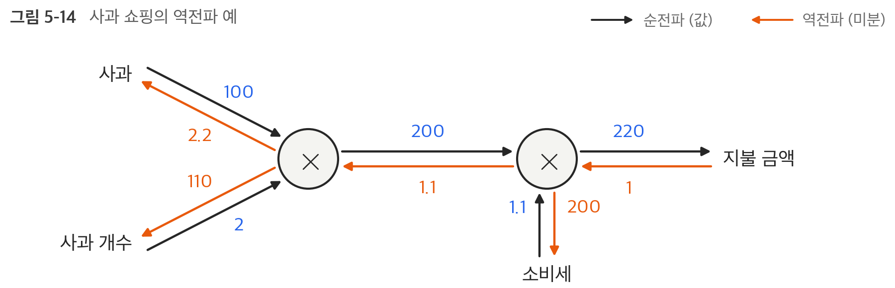

곱셈 노드의 역전파는 입력 신호를 서로 바꿔서 하류로 흘리므로 사과 가격의 미분은 2.2, 사과 개수의 미분은 110, 소비세의 미분은 200이 된다. 소비세와 사과 가격이 같은 양만큼 오르면 소비세는 200의 크기로, 사과 가격은 2.2의 크기로 최종 금액에 영향을 준다는 뜻이다. (소비세 1은 100%를 뜻해서 단위가 다르기 때문에 값이 크게 나온다)

사과와 귤 쇼핑의 역전파도 같은 방법으로 구할 수 있다. 책에서는 빈칸을 채우는 문제로 나오는데 직접 채워 보면 다음과 같다.

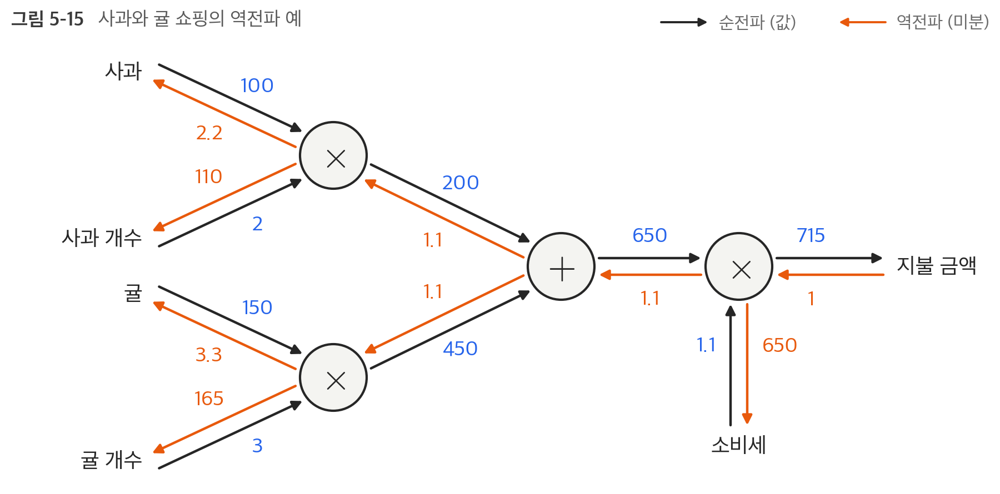

| 변수 | 순전파 값 | 역전파 값 (지불 금액에 대한 미분) |
| --- | --- | --- |
| 사과 가격 | 100 | 2.2 |
| 사과 개수 | 2 | 110 |
| 귤 가격 | 150 | 3.3 |
| 귤 개수 | 3 | 165 |
| 소비세 | 1.1 | 650 |

덧셈 노드는 1.1을 양쪽에 그대로 흘려보내고, 곱셈 노드는 입력을 서로 바꿔서 곱한다는 규칙만 지키면 된다.

## 5 - 4. 단순한 계층 구현하기

사과 쇼핑 예를 파이썬으로 구현한다. 계산 그래프의 곱셈 노드를 `MulLayer`, 덧셈 노드를 `AddLayer`라는 이름으로 구현한다. 여기서 말하는 계층(layer)은 신경망의 기능 단위로, 앞으로 신경망을 구성하는 계층 각각을 하나의 클래스로 구현한다. 모든 계층은 순전파를 처리하는 `forward()`와 역전파를 처리하는 `backward()`라는 공통의 메서드를 갖는다.

### 5 - 4 - 1. 곱셈 계층

```python
class MulLayer:
    def __init__(self):
        self.x = None
        self.y = None

    def forward(self, x, y):
        self.x = x
        self.y = y
        out = x * y

        return out

    def backward(self, dout):
        dx = dout * self.y  # x와 y를 바꾼다.
        dy = dout * self.x

        return dx, dy
```

`__init__()`에서는 인스턴스 변수 x와 y를 초기화하는데, 이 두 변수는 순전파 때의 입력 값을 유지하기 위해 사용한다. `backward()`에서는 상류에서 넘어온 미분(`dout`)에 순전파 때의 값을 '서로 바꿔' 곱한 후 하류로 흘린다.

다음은 `MulLayer`를 사용해서 사과 쇼핑을 구현한 것이다.

```python
apple = 100
apple_num = 2
tax = 1.1

# 계층들
mul_apple_layer = MulLayer()
mul_tax_layer = MulLayer()

# 순전파
apple_price = mul_apple_layer.forward(apple, apple_num)
price = mul_tax_layer.forward(apple_price, tax)

print(price)  # 220.00000000000003

# 역전파
dprice = 1
dapple_price, dtax = mul_tax_layer.backward(dprice)
dapple, dapple_num = mul_apple_layer.backward(dapple_price)

print(dapple, dapple_num, dtax)  # 2.2 110.00000000000001 200
```

`backward()`의 호출 순서는 `forward()` 때와는 반대이다. 결과가 그림 5-14와 같은 것을 확인할 수 있다. 220이 아니라 220.00000000000003으로 나오는 것은 1.1을 2진수로 정확하게 표현할 수 없어서 생기는 부동소수점 오차이다.

### 5 - 4 - 2. 덧셈 계층

```python
class AddLayer:
    def __init__(self):
        pass

    def forward(self, x, y):
        out = x + y
        return out

    def backward(self, dout):
        dx = dout * 1
        dy = dout * 1
        return dx, dy
```

덧셈 계층은 역전파 때 순전파의 입력 값이 필요 없어서 초기화할 것이 없다. 그래서 `__init__()`에서는 `pass`만 한다.

```python
apple = 100
apple_num = 2
orange = 150
orange_num = 3
tax = 1.1

# 계층들
mul_apple_layer = MulLayer()
mul_orange_layer = MulLayer()
add_apple_orange_layer = AddLayer()
mul_tax_layer = MulLayer()

# 순전파
apple_price = mul_apple_layer.forward(apple, apple_num)  # (1)
orange_price = mul_orange_layer.forward(orange, orange_num)  # (2)
all_price = add_apple_orange_layer.forward(apple_price, orange_price)  # (3)
price = mul_tax_layer.forward(all_price, tax)  # (4)

# 역전파
dprice = 1
dall_price, dtax = mul_tax_layer.backward(dprice)  # (4)
dapple_price, dorange_price = add_apple_orange_layer.backward(dall_price)  # (3)
dorange, dorange_num = mul_orange_layer.backward(dorange_price)  # (2)
dapple, dapple_num = mul_apple_layer.backward(dapple_price)  # (1)

print(price)  # 715.0000000000001
print(dapple_num, dapple, dorange, dorange_num, dtax)  # 110.00000000000001 2.2 3.3000000000000003 165.0 650
```

필요한 계층을 만들어 순전파 메서드 `forward()`를 적절한 순서로 호출하고, 순전파와 반대 순서로 역전파 메서드 `backward()`를 호출하면 원하는 미분이 나온다. 그림 5-15에서 손으로 구한 값과 같다.

## 5 - 5. 활성화 함수 계층 구현하기

이제 계산 그래프를 신경망에 적용한다. 신경망을 구성하는 층(계층) 각각을 클래스 하나로 구현하는데, 우선 활성화 함수인 ReLU와 Sigmoid 계층부터 구현한다.

### 5 - 5 - 1. ReLU 계층

활성화 함수로 사용되는 ReLU의 수식과 $x$에 대한 $y$의 미분은 다음과 같다.

$$
y = \begin{cases} x & (x > 0) \\ 0 & (x \le 0) \end{cases}
\qquad\qquad
\frac{\partial y}{\partial x} = \begin{cases} 1 & (x > 0) \\ 0 & (x \le 0) \end{cases}
$$

순전파 때의 입력인 $x$가 0보다 크면 역전파는 상류의 값을 그대로 하류로 흘린다. 반면 순전파 때 $x$가 0 이하면 역전파 때는 하류로 신호를 보내지 않는다(0을 보낸다).

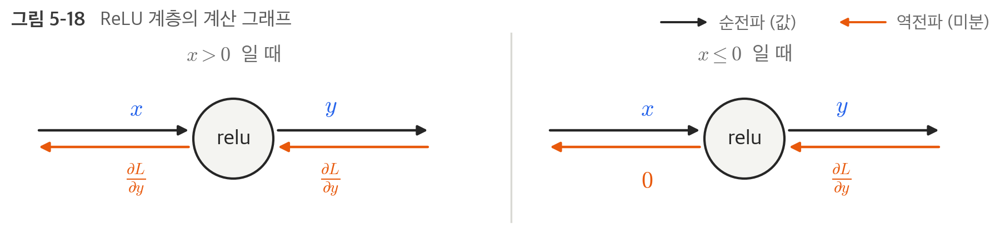

```python
class Relu:
    def __init__(self):
        self.mask = None

    def forward(self, x):
        self.mask = (x <= 0)
        out = x.copy()
        out[self.mask] = 0

        return out

    def backward(self, dout):
        dout[self.mask] = 0
        dx = dout

        return dx
```

`Relu` 클래스는 `mask`라는 인스턴스 변수를 가진다. `mask`는 True/False로 구성된 넘파이 배열로, 순전파의 입력인 `x`의 원소 값이 0 이하인 인덱스는 True, 그 외(0보다 큰 원소)는 False로 유지한다.

```python
x = np.array([[1.0, -0.5], [-2.0, 3.0]])
print(x)
# [[ 1.  -0.5]
#  [-2.   3. ]]

mask = (x <= 0)
print(mask)
# [[False  True]
#  [ True False]]
```

역전파 때는 순전파 때 만들어 둔 `mask`를 써서, `mask`의 원소가 True인 곳에는 상류에서 전파된 `dout`을 0으로 설정한다.

ReLU 계층은 전기 회로의 '스위치'에 비유할 수 있다. 순전파 때 전류가 흐르고 있으면 스위치를 ON으로 하고, 흐르지 않으면 OFF로 한다. 역전파 때는 스위치가 ON이라면 전류가 그대로 흐르고, OFF면 더 이상 흐르지 않는다.

### 5 - 5 - 2. Sigmoid 계층

시그모이드 함수의 식은 다음과 같다.

$$
y = \frac{1}{1 + \exp(-x)}
$$

이 식을 계산 그래프로 그리면 ×와 + 노드 말고도 exp와 / 노드가 새롭게 등장한다. exp 노드는 $y = \exp(x)$ 계산을, / 노드는 $y = \frac{1}{x}$ 계산을 수행한다.

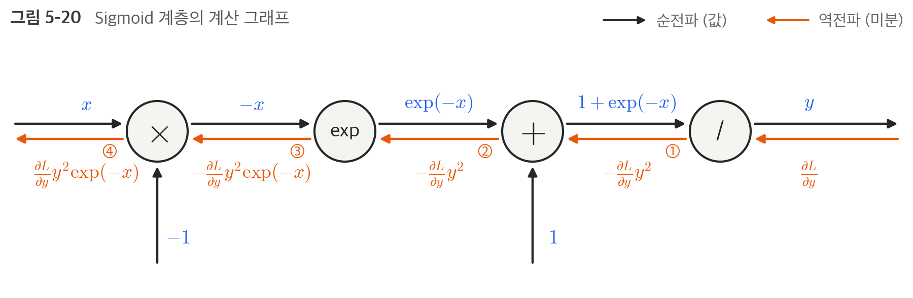

역전파를 오른쪽부터 한 단계씩 짚어 보면 다음과 같다. 그림의 ①~④가 각 단계에서 하류로 보내는 값이다.

| 단계 | 노드 | 국소적 미분 | 하류로 보내는 값 |
| --- | --- | --- | --- |
| ① | / | $\frac{\partial y}{\partial x} = -\frac{1}{x^2} = -y^2$ | $-\frac{\partial L}{\partial y}y^2$ |
| ② | + | 1 (그대로 흘려보냄) | $-\frac{\partial L}{\partial y}y^2$ |
| ③ | exp | $\frac{\partial y}{\partial x} = \exp(x)$, 여기서는 $\exp(-x)$ | $-\frac{\partial L}{\partial y}y^2\exp(-x)$ |
| ④ | × | 순전파 때의 값을 서로 바꿔 곱함 (−1) | $\frac{\partial L}{\partial y}y^2\exp(-x)$ |

결과적으로 Sigmoid 계층의 역전파 출력은 $\frac{\partial L}{\partial y}y^2\exp(-x)$이고, 이 값은 순전파의 입력 $x$와 출력 $y$만으로 계산할 수 있다. 그래서 중간 과정을 모두 묶어 'sigmoid' 노드 하나로 대체할 수 있다. 이렇게 간소화하면 역전파 과정의 중간 계산들을 생략할 수 있어 더 효율적이고, 노드를 묶었기 때문에 Sigmoid 계층의 세세한 내용은 신경 쓰지 않고 입력과 출력에만 집중할 수 있다.

또한 이 식은 다음처럼 더 정리할 수 있다.

$$
\begin{aligned}
\frac{\partial L}{\partial y}y^2\exp(-x)
&= \frac{\partial L}{\partial y}\frac{1}{(1+\exp(-x))^2}\exp(-x) \\
&= \frac{\partial L}{\partial y}\frac{1}{1+\exp(-x)}\frac{\exp(-x)}{1+\exp(-x)} \\
&= \frac{\partial L}{\partial y}\,y\,(1-y)
\end{aligned}
$$

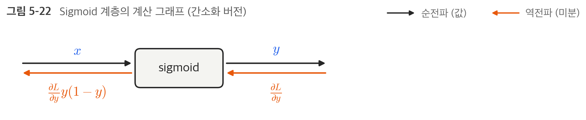

이처럼 Sigmoid 계층의 역전파는 순전파의 출력($y$)만으로 계산할 수 있다.

```python
class Sigmoid:
    def __init__(self):
        self.out = None

    def forward(self, x):
        out = 1 / (1 + np.exp(-x))
        self.out = out

        return out

    def backward(self, dout):
        dx = dout * (1.0 - self.out) * self.out

        return dx
```

순전파의 출력을 인스턴스 변수 `out`에 보관했다가 역전파 계산 때 그 값을 사용한다.

## 5 - 6. Affine/Softmax 계층 구현하기

### 5 - 6 - 1. Affine 계층

신경망의 순전파에서는 가중치 신호의 총합을 계산하기 위해 행렬의 곱(넘파이에서는 `np.dot()`)을 사용했다.

```python
X = np.random.rand(2)     # 입력
W = np.random.rand(2, 3)  # 가중치
B = np.random.rand(3)     # 편향

print(X.shape)  # (2,)
print(W.shape)  # (2, 3)
print(B.shape)  # (3,)

Y = np.dot(X, W) + B
```

3장에서 본 것처럼 행렬의 곱에서는 대응하는 차원의 원소 수를 일치시켜야 한다. X의 원소 수 2와 W의 행 수 2가 같아야 하고, 결과는 W의 열 수와 같은 3개의 원소를 가진다.

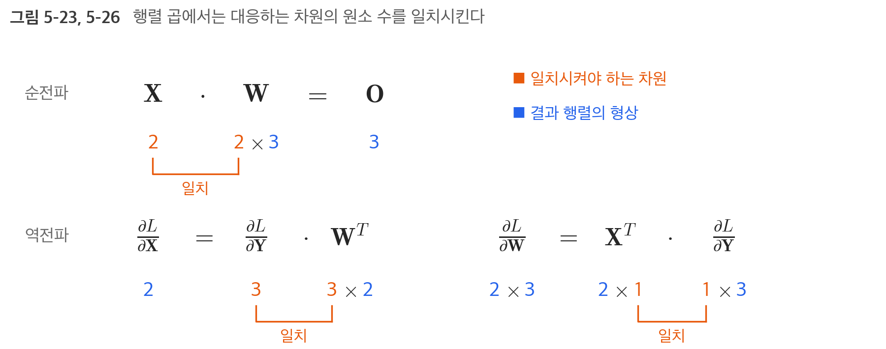

신경망의 순전파 때 수행하는 행렬의 곱은 기하학에서는 어파인 변환(affine transformation)이라고 한다. 그래서 어파인 변환을 수행하는 처리를 'Affine 계층'이라는 이름으로 구현한다.

지금까지의 계산 그래프는 노드 사이에 '스칼라값'이 흘렀는데, 이번에는 '행렬'이 흐른다. 행렬을 사용한 역전파도 원소마다 전개해 보면 지금까지와 같은 순서로 생각할 수 있고, 결과는 다음과 같다.

$$
\frac{\partial L}{\partial \mathbf{X}} = \frac{\partial L}{\partial \mathbf{Y}} \cdot \mathbf{W}^{T}
\qquad\qquad
\frac{\partial L}{\partial \mathbf{W}} = \mathbf{X}^{T} \cdot \frac{\partial L}{\partial \mathbf{Y}}
$$

$\mathbf{W}^{T}$의 T는 전치행렬을 뜻한다. 전치행렬은 W의 (i, j) 위치의 원소를 (j, i) 위치로 바꾼 것으로, W의 형상이 (2, 3)이면 $\mathbf{W}^{T}$의 형상은 (3, 2)가 된다.

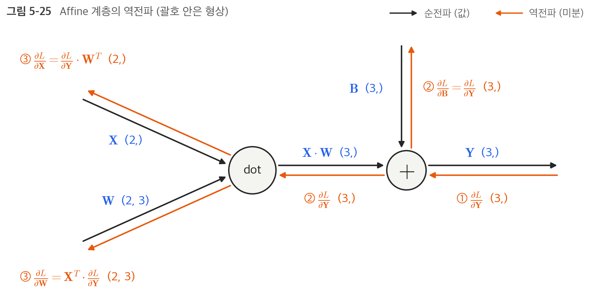

여기서 주의할 점은 X와 $\frac{\partial L}{\partial \mathbf{X}}$는 같은 형상이고, W와 $\frac{\partial L}{\partial \mathbf{W}}$도 같은 형상이라는 것이다. 행렬 곱의 역전파는 이 점을 이용해서 형상이 맞도록 곱을 조립하면 된다. 예를 들어 $\frac{\partial L}{\partial \mathbf{Y}}$의 형상이 (3,)이고 W의 형상이 (2, 3)일 때, $\frac{\partial L}{\partial \mathbf{X}}$가 X와 같은 (2,)가 되려면 $\frac{\partial L}{\partial \mathbf{Y}}$에 $\mathbf{W}^{T}$ (3, 2)를 곱해야 한다. 위의 그림 5-23, 5-26에서 역전파 줄이 이 과정이다.

### 5 - 6 - 2. 배치용 Affine 계층

지금까지는 입력 데이터로 X 하나만 고려했다. 이번에는 데이터 N개를 묶어 순전파하는 경우, 즉 배치용 Affine 계층을 생각한다.

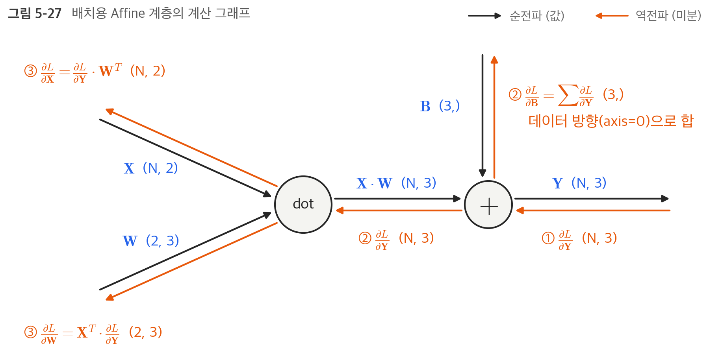

기존과 다른 부분은 입력인 X의 형상이 (N, 2)가 된 것뿐이다. 그 뒤로는 지금까지와 같이 계산 그래프의 순서를 따라 행렬 계산을 하면 된다.

편향을 더할 때는 주의해야 한다. 순전파 때의 편향 덧셈은 X·W의 각 데이터에 똑같은 편향이 더해진다(브로드캐스트). 예를 들어 N = 2라면 편향은 두 데이터 각각에 더해진다. 그래서 역전파 때는 각 데이터의 역전파 값이 편향의 원소에 모여야 한다.

```python
dY = np.array([[1, 2, 3], [4, 5, 6]])
dB = np.sum(dY, axis=0)
print(dB)  # [5 7 9]
```

데이터가 2개라면 편향의 역전파는 두 데이터에 대한 미분을 데이터마다 더해서 구한다. 그래서 `np.sum()`에서 0번째 축(데이터를 단위로 한 축)에 대해 합을 구한다.

```python
class Affine:
    def __init__(self, W, b):
        self.W = W
        self.b = b
        self.x = None
        self.dW = None
        self.db = None

    def forward(self, x):
        self.x = x
        out = np.dot(x, self.W) + self.b

        return out

    def backward(self, dout):
        dx = np.dot(dout, self.W.T)
        self.dW = np.dot(self.x.T, dout)
        self.db = np.sum(dout, axis=0)

        return dx
```

책의 소스 코드(`common/layers.py`)에는 입력이 이미지 같은 4차원 텐서일 때를 대비해서 입력을 2차원으로 바꿨다가 되돌리는 코드가 더 들어 있다.

### 5 - 6 - 3. Softmax-with-Loss 계층

출력층에서 사용하는 소프트맥스 함수는 입력 값을 정규화하여 출력한다. 손글씨 숫자 인식에서는 10개의 입력을 받아 합이 1인 확률 10개로 바꾼다. 아래는 5 - 7에서 직접 학습시킨 신경망에 숫자 2 이미지를 넣었을 때 마지막 Affine 계층의 출력과 Softmax 계층의 출력이다.

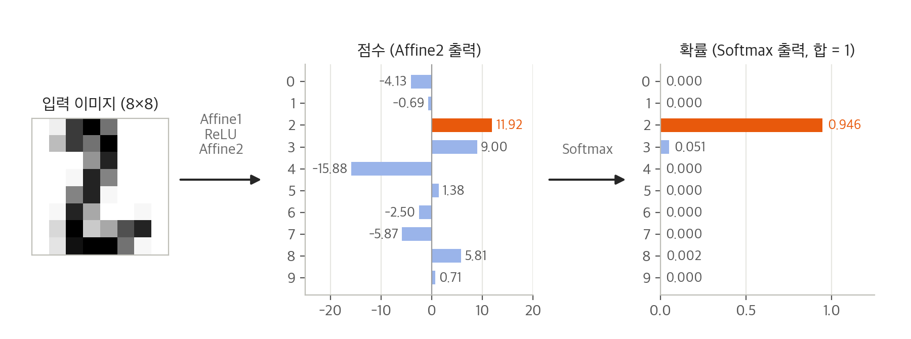

숫자 2의 출력 11.92는 확률 0.946(94.6%)으로, 두 번째로 큰 3의 출력 9.00은 0.051(5.1%)로 바뀌었다. 크기 순서는 그대로이고 값만 0~1 사이의 확률로 정규화된 것이다. 이렇게 Softmax 앞의 정규화되지 않은 출력을 점수(score)라고 한다.

신경망에서 수행하는 작업은 학습과 추론 두 가지이다. 추론할 때는 일반적으로 Softmax 계층을 사용하지 않는다. 가장 높은 점수만 알면 되므로 점수를 정규화할 필요가 없기 때문이다. 반면 학습할 때는 손실 함수 값을 구하려면 확률이 필요하므로 Softmax 계층이 필요하다.

그래서 손실 함수인 교차 엔트로피 오차도 포함하여 'Softmax-with-Loss 계층'이라는 이름으로 구현한다. Softmax-with-Loss 계층의 계산 그래프는 꽤 복잡한데(책의 부록 A에서 자세히 유도한다), 간소화하면 다음과 같다.

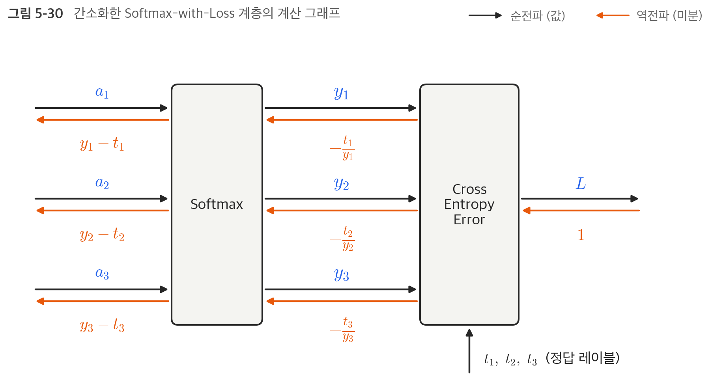

Softmax 계층은 입력 $(a_1, a_2, a_3)$를 정규화하여 $(y_1, y_2, y_3)$를 출력하고, Cross Entropy Error 계층은 Softmax의 출력 $(y_1, y_2, y_3)$와 정답 레이블 $(t_1, t_2, t_3)$를 받아서 손실 $L$을 출력한다.

여기서 주목할 것은 역전파의 결과이다. Softmax 계층의 역전파는 $(y_1 - t_1, y_2 - t_2, y_3 - t_3)$라는 '말끔한' 결과를 내놓는다. Softmax 계층의 출력과 정답 레이블의 차분, 즉 **신경망의 현재 출력과 정답 레이블의 오차**를 그대로 앞 계층에 전달하는 것이다.

왜 이렇게 되는지 식으로 간단히 확인해 보면, 교차 엔트로피 오차와 소프트맥스 함수는

$$
L = -\sum_k t_k \log y_k, \qquad y_k = \frac{\exp(a_k)}{S}, \qquad S = \sum_i \exp(a_i)
$$

이다. $\log y_k = a_k - \log S$이고 원-핫 인코딩된 정답 레이블은 $\sum_k t_k = 1$이므로

$$
L = -\sum_k t_k a_k + \log S
\quad\Longrightarrow\quad
\frac{\partial L}{\partial a_k} = -t_k + \frac{\exp(a_k)}{S} = y_k - t_k
$$

가 된다.

신경망 학습의 목적은 신경망의 출력(Softmax의 출력)이 정답 레이블과 가까워지도록 가중치 매개변수의 값을 조정하는 것이다. 그래서 신경망의 출력과 정답 레이블의 오차를 효율적으로 앞 계층에 전달해야 한다. 이런 말끔한 결과는 우연이 아니라 교차 엔트로피 오차라는 함수가 그렇게 되도록 설계되었기 때문이다. 회귀의 출력층에서 사용하는 '항등 함수'의 손실 함수로 '오차제곱합'을 이용하는 이유도 이와 같다.

| 출력층 활성화 함수 | 손실 함수 | 문제 | 역전파 결과 |
| --- | --- | --- | --- |
| 소프트맥스 함수 | 교차 엔트로피 오차 | 분류 | $y - t$ |
| 항등 함수 | 오차제곱합 | 회귀 | $y - t$ |

예를 들어 정답 레이블이 (0, 1, 0)일 때

- Softmax 계층이 (0.3, 0.2, 0.5)를 출력한 경우 : 정답의 확률이 0.2밖에 안 되므로 역전파는 (0.3, −0.8, 0.5)라는 커다란 오차를 전파한다 -> 앞 계층들이 크게 학습한다
- Softmax 계층이 (0.01, 0.99, 0)을 출력한 경우 : 역전파는 (0.01, −0.01, 0)으로 오차가 작다 -> 학습하는 정도도 작아진다

```python
class SoftmaxWithLoss:
    def __init__(self):
        self.loss = None  # 손실
        self.y = None     # softmax의 출력
        self.t = None     # 정답 레이블(원-핫 벡터)

    def forward(self, x, t):
        self.t = t
        self.y = softmax(x)
        self.loss = cross_entropy_error(self.y, self.t)
        return self.loss

    def backward(self, dout=1):
        batch_size = self.t.shape[0]
        dx = (self.y - self.t) / batch_size

        return dx
```

`softmax()`와 `cross_entropy_error()`는 3장, 4장에서 구현한 함수를 그대로 사용한다. 역전파 때는 전파하는 값을 배치의 수(`batch_size`)로 나눠서 데이터 1개당 오차를 앞 계층으로 전파한다.

## 5 - 7. 오차역전파법 구현하기

지금까지 구현한 계층을 레고 블록처럼 조합하면 신경망을 구축할 수 있다.

### 5 - 7 - 1. 신경망 학습의 전체 그림

전제 : 신경망에는 적응 가능한 가중치와 편향이 있고, 이 가중치와 편향을 훈련 데이터에 적응하도록 조정하는 과정을 '학습'이라 한다. 신경망 학습은 다음 4단계로 수행한다.

1) 미니배치 : 훈련 데이터 중 일부를 무작위로 가져온다
2) 기울기 산출 : 미니배치의 손실 함수 값을 줄이기 위해 각 가중치 매개변수의 기울기를 구한다
3) 매개변수 갱신 : 가중치 매개변수를 기울기 방향으로 아주 조금 갱신한다
4) 반복 : 1~3단계를 반복한다

오차역전파법이 등장하는 단계는 2단계 '기울기 산출'이다. 4장에서는 이 기울기를 수치 미분으로 구했지만, 오차역전파법을 이용하면 매개변수가 많아도 기울기를 빠르게 구할 수 있다.

### 5 - 7 - 2. 오차역전파법을 적용한 신경망 구현하기

2층 신경망을 `TwoLayerNet` 클래스로 구현한다. 4장에서 구현한 `TwoLayerNet`과 거의 같고 계층을 사용한다는 점만 다르다.

| 인스턴스 변수 / 메서드 | 설명 |
| --- | --- |
| `params` | 신경망의 매개변수를 보관하는 딕셔너리 (`W1`, `b1`, `W2`, `b2`) |
| `layers` | 신경망의 계층을 순서대로 보관하는 `OrderedDict` |
| `lastLayer` | 신경망의 마지막 계층 (`SoftmaxWithLoss`) |
| `predict(x)` | 예측(추론)을 수행한다 |
| `loss(x, t)` | 손실 함수의 값을 구한다 |
| `accuracy(x, t)` | 정확도를 구한다 |
| `numerical_gradient(x, t)` | 가중치 매개변수의 기울기를 **수치 미분**으로 구한다 (4장과 같음) |
| `gradient(x, t)` | 가중치 매개변수의 기울기를 **오차역전파법**으로 구한다 |

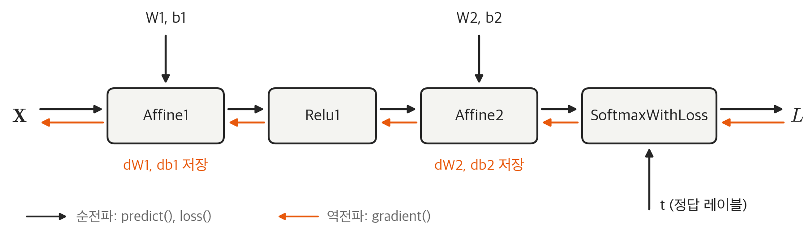

```python
import sys, os
sys.path.append(os.pardir)
import numpy as np
from common.layers import *
from common.gradient import numerical_gradient
from collections import OrderedDict

class TwoLayerNet:

    def __init__(self, input_size, hidden_size, output_size, weight_init_std=0.01):
        # 가중치 초기화
        self.params = {}
        self.params['W1'] = weight_init_std * np.random.randn(input_size, hidden_size)
        self.params['b1'] = np.zeros(hidden_size)
        self.params['W2'] = weight_init_std * np.random.randn(hidden_size, output_size)
        self.params['b2'] = np.zeros(output_size)

        # 계층 생성
        self.layers = OrderedDict()
        self.layers['Affine1'] = Affine(self.params['W1'], self.params['b1'])
        self.layers['Relu1'] = Relu()
        self.layers['Affine2'] = Affine(self.params['W2'], self.params['b2'])

        self.lastLayer = SoftmaxWithLoss()

    def predict(self, x):
        for layer in self.layers.values():
            x = layer.forward(x)

        return x

    # x : 입력 데이터, t : 정답 레이블
    def loss(self, x, t):
        y = self.predict(x)
        return self.lastLayer.forward(y, t)

    def accuracy(self, x, t):
        y = self.predict(x)
        y = np.argmax(y, axis=1)
        if t.ndim != 1 : t = np.argmax(t, axis=1)

        accuracy = np.sum(y == t) / float(x.shape[0])
        return accuracy

    # x : 입력 데이터, t : 정답 레이블
    def numerical_gradient(self, x, t):
        loss_W = lambda W: self.loss(x, t)

        grads = {}
        grads['W1'] = numerical_gradient(loss_W, self.params['W1'])
        grads['b1'] = numerical_gradient(loss_W, self.params['b1'])
        grads['W2'] = numerical_gradient(loss_W, self.params['W2'])
        grads['b2'] = numerical_gradient(loss_W, self.params['b2'])

        return grads

    def gradient(self, x, t):
        # 순전파
        self.loss(x, t)

        # 역전파
        dout = 1
        dout = self.lastLayer.backward(dout)

        layers = list(self.layers.values())
        layers.reverse()
        for layer in layers:
            dout = layer.backward(dout)

        # 결과 저장
        grads = {}
        grads['W1'], grads['b1'] = self.layers['Affine1'].dW, self.layers['Affine1'].db
        grads['W2'], grads['b2'] = self.layers['Affine2'].dW, self.layers['Affine2'].db

        return grads
```

신경망의 계층을 `OrderedDict`에 보관하는 점이 중요하다. `OrderedDict`는 순서가 있는 딕셔너리로, 딕셔너리에 추가한 원소의 순서를 기억한다. 그래서 순전파 때는 추가한 순서대로 각 계층의 `forward()`를 호출하기만 하면 되고, 역전파 때는 계층을 반대 순서로 호출하기만 하면 된다.

Affine 계층과 ReLU 계층이 각자의 내부에서 순전파와 역전파를 제대로 처리하고 있으니, 여기서는 계층을 올바른 순서로 연결한 다음 순서대로(또는 역순으로) 호출해 주면 끝이다. 이처럼 신경망의 구성 요소를 '계층'으로 구현했기 때문에 5층, 10층, 20층처럼 깊은 신경망을 만들고 싶다면 필요한 만큼 계층을 더 추가하기만 하면 된다.

### 5 - 7 - 3. 오차역전파법으로 구한 기울기 검증하기

기울기를 구하는 방법은 두 가지가 있다.

- 수치 미분 : 느리지만 구현하기 쉽다
- 오차역전파법 : 매개변수가 많아도 효율적으로 계산할 수 있지만 구현이 복잡해서 실수가 생기기 쉽다

그래서 수치 미분의 결과와 오차역전파법의 결과를 비교하여 오차역전파법을 제대로 구현했는지 검증한다. 이처럼 두 방식으로 구한 기울기가 일치함(거의 같음)을 확인하는 작업을 **기울기 확인**(gradient check)이라고 한다.

```python
import sys, os
sys.path.append(os.pardir)
import numpy as np
from dataset.mnist import load_mnist
from two_layer_net import TwoLayerNet

# 데이터 읽기
(x_train, t_train), (x_test, t_test) = load_mnist(normalize=True, one_hot_label=True)

network = TwoLayerNet(input_size=784, hidden_size=50, output_size=10)

x_batch = x_train[:3]
t_batch = t_train[:3]

grad_numerical = network.numerical_gradient(x_batch, t_batch)
grad_backprop = network.gradient(x_batch, t_batch)

# 각 가중치의 절대 오차의 평균을 구한다.
for key in grad_numerical.keys():
    diff = np.average( np.abs(grad_backprop[key] - grad_numerical[key]) )
    print(key + ":" + str(diff))
```

직접 실행한 결과는 다음과 같다. MNIST 대신 scikit-learn에 들어 있는 손글씨 숫자 데이터(digits)를 사용했는데, 이미지가 8×8 픽셀이라 입력 크기가 784가 아닌 64인 것만 다르다.

| 매개변수 | 형상 | 평균 절대 오차 |
| --- | --- | --- |
| W1 | (64, 50) | 6.6 × 10⁻¹⁰ |
| b1 | (50,) | 1.6 × 10⁻⁹ |
| W2 | (50, 10) | 1.5 × 10⁻⁹ |
| b2 | (10,) | 1.4 × 10⁻⁷ |

오차가 모두 0에 아주 가까우므로 오차역전파법으로 구한 기울기도 올바르다고 볼 수 있다. 오차가 정확히 0이 되지 않는 것은 컴퓨터가 할 수 있는 계산의 정밀도가 유한하고 수치 미분 자체가 근사값이기 때문이다. b2의 오차가 상대적으로 큰 것은 `cross_entropy_error()`가 log 안에 아주 작은 값(1e-7)을 더하기 때문에 수치 미분 쪽 결과가 아주 조금 달라지는 영향이다. 구현에 실수가 있었다면 이보다 훨씬 큰 오차가 나온다.

### 5 - 7 - 4. 오차역전파법을 사용한 학습 구현하기

```python
import sys, os
sys.path.append(os.pardir)
import numpy as np
from dataset.mnist import load_mnist
from two_layer_net import TwoLayerNet

# 데이터 읽기
(x_train, t_train), (x_test, t_test) = load_mnist(normalize=True, one_hot_label=True)

network = TwoLayerNet(input_size=784, hidden_size=50, output_size=10)

iters_num = 10000
train_size = x_train.shape[0]
batch_size = 100
learning_rate = 0.1

train_loss_list = []
train_acc_list = []
test_acc_list = []

iter_per_epoch = max(train_size / batch_size, 1)

for i in range(iters_num):
    batch_mask = np.random.choice(train_size, batch_size)
    x_batch = x_train[batch_mask]
    t_batch = t_train[batch_mask]

    # 기울기 계산
    # grad = network.numerical_gradient(x_batch, t_batch)  # 수치 미분 방식
    grad = network.gradient(x_batch, t_batch)  # 오차역전파법 방식(훨씬 빠르다)

    # 갱신
    for key in ('W1', 'b1', 'W2', 'b2'):
        network.params[key] -= learning_rate * grad[key]

    loss = network.loss(x_batch, t_batch)
    train_loss_list.append(loss)

    if i % iter_per_epoch == 0:
        train_acc = network.accuracy(x_train, t_train)
        test_acc = network.accuracy(x_test, t_test)
        train_acc_list.append(train_acc)
        test_acc_list.append(test_acc)
        print(train_acc, test_acc)
```

4장의 학습 코드와 달라진 부분은 기울기를 오차역전파법으로 구하는 한 줄뿐이다.

마찬가지로 digits 데이터로 직접 학습시킨 결과이다. 신경망은 64-50-10 구조이고 배치 크기 100, 학습률 0.1로 3,000번 반복했다.

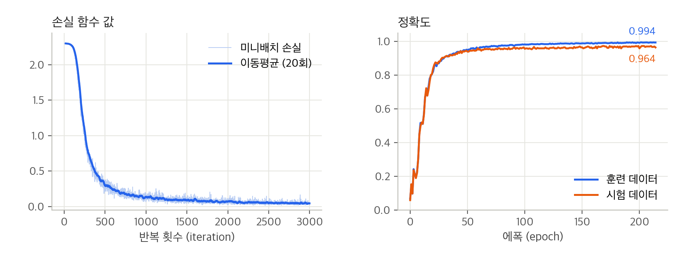

| 항목 | 값 |
| --- | --- |
| 데이터 | digits (훈련 1,437장 / 시험 360장) |
| 손실 함수 값 | 2.302 → 0.062 |
| 최종 훈련 정확도 | 99.4% |
| 최종 시험 정확도 | 96.4% |
| 학습에 걸린 시간 | 약 0.5초 |

손실 함수 값이 빠르게 줄어들고 정확도가 올라간다. 훈련 데이터와 시험 데이터의 정확도 차이가 크지 않아 오버피팅도 심하지 않다.

## 5 - 8. 정리

- 계산 그래프를 이용하면 계산 과정을 시각적으로 파악할 수 있다
- 계산 그래프의 노드는 국소적 계산으로 구성되고, 국소적 계산을 조합해서 전체 계산을 구성한다
- 순전파는 통상의 계산을 수행하고, 역전파는 연쇄법칙에 따라 국소적 미분을 곱해 나가면서 각 노드의 미분을 구한다
- 신경망의 구성 요소를 계층으로 구현하면 기울기를 효율적으로 계산할 수 있다 (오차역전파법)
- 수치 미분과 오차역전파법의 결과를 비교하면 오차역전파법의 구현에 잘못이 없는지 확인할 수 있다 (기울기 확인)

이번 장에서 구현한 계층을 한 번에 정리하면 다음과 같다.

| 계층 | 순전파 | 역전파 (하류로 보내는 값) | 순전파 때 저장해 두는 값 |
| --- | --- | --- | --- |
| `MulLayer` | $z = xy$ | $\mathrm{dout} \cdot y$, $\mathrm{dout} \cdot x$ | x, y |
| `AddLayer` | $z = x + y$ | $\mathrm{dout}$, $\mathrm{dout}$ | 없음 |
| `Relu` | $y = \max(0, x)$ | x > 0이면 dout, x ≤ 0이면 0 | mask |
| `Sigmoid` | $y = \frac{1}{1 + \exp(-x)}$ | $\mathrm{dout} \cdot y(1 - y)$ | 출력 y |
| `Affine` | $Y = XW + B$ | $dX = \mathrm{dout} \cdot W^{T}$, $dW = X^{T} \cdot \mathrm{dout}$, $dB = \sum \mathrm{dout}$ | 입력 X |
| `SoftmaxWithLoss` | 소프트맥스 → 교차 엔트로피 오차 | $(y - t) / N$ | y, t |

## 내 생각

**1. 수치 미분과 오차역전파법의 연산량 비교**

4장에서 계획했던 대로 수치 미분과 오차역전파법의 기울기 계산 시간을 직접 비교해 보았다. MNIST와 같은 입력 784, 출력 10인 2층 신경망에서 은닉층 뉴런 수만 바꿔 가며, 배치 100개에 대한 기울기를 한 번 구하는 시간을 측정하였다. MCU처럼 코어 하나만 쓰는 상황을 가정해서 넘파이도 스레드 1개로 제한하였다.

```python
import os
os.environ['OPENBLAS_NUM_THREADS'] = '1'  # 코어 1개만 사용 (numpy import 전에 설정)
import time
import numpy as np
from two_layer_net import TwoLayerNet

x = np.random.rand(100, 784)                   # MNIST 크기의 입력 100개
t = np.eye(10)[np.random.randint(0, 10, 100)]  # 원-핫 정답 레이블
network = TwoLayerNet(input_size=784, hidden_size=50, output_size=10)

start = time.perf_counter()
network.numerical_gradient(x, t)
print('수치 미분   :', time.perf_counter() - start)

start = time.perf_counter()
network.gradient(x, t)
print('오차역전파법 :', time.perf_counter() - start)
```

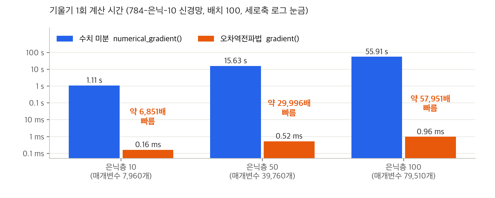

| 은닉층 뉴런 | 매개변수 수 P | 수치 미분 | 오차역전파법 | 배율 (실측) | 배율 (이론 2P/3) |
| --- | --- | --- | --- | --- | --- |
| 10 | 7,960 | 1.11 s | 0.16 ms | 약 6,851배 | 약 5,307배 |
| 50 | 39,760 | 15.63 s | 0.52 ms | 약 29,996배 | 약 26,507배 |
| 100 | 79,510 | 55.91 s | 0.96 ms | 약 57,951배 | 약 53,007배 |

이론 배율은 다음과 같이 어림했다. 순전파 한 번의 연산량은 데이터 1개당 대략 2P(곱셈 P번, 덧셈 P번)이다. 수치 미분은 매개변수 하나마다 순전파를 2번씩 하므로 2P × 2P = 4P²이 든다. 오차역전파법은 순전파 1번(2P)과 역전파 1번(Affine 계층마다 dx와 dW를 구하므로 약 4P)으로 모든 매개변수의 기울기가 나오므로 약 6P이다. 따라서 둘의 비율은 4P² / 6P = 2P/3이고, 실측값도 이 경향을 그대로 따랐다. 수치 미분은 매개변수 수의 제곱에, 오차역전파법은 매개변수 수에 비례해서 시간이 늘어난다.

책의 설정(은닉층 50, 10,000번 반복)으로 학습한다면 기울기 계산에만 수치 미분은 15.63 s × 10,000 ≈ 43시간이 걸리지만 오차역전파법은 0.52 ms × 10,000 ≈ 5초면 된다.

4장에서 이야기한 MCU에 대입해 보면 차이가 더 체감된다. 1초에 1억 번(100 MFLOPS) 연산하는 MCU라고 가정하면, 은닉층 50인 신경망에서 데이터 1개의 기울기를 구하는 데 오차역전파법은 약 6P ≈ 24만 번의 연산으로 약 2.4 ms, 수치 미분은 4P² ≈ 63억 번의 연산으로 약 63초가 걸린다. 연산량만 보면 오차역전파법이라면 MCU에서도 학습을 시도해 볼 만한 수준이 된다.

**2. 오차역전파법의 메모리 비용**

하지만 오차역전파법이 공짜는 아니었다. 이번 장의 계층들은 역전파를 위해 순전파 때의 값을 저장해 둔다(`MulLayer`의 x, y, `Relu`의 mask, `Affine`의 x, `Sigmoid`의 out, `SoftmaxWithLoss`의 y, t). 계산 그래프의 장점이었던 '중간 계산 결과를 보관할 수 있다'는 것이 곧 메모리를 쓴다는 뜻이다. 784-50-10 신경망을 float32로 학습할 때 필요한 메모리를 직접 재 보았다.

| 항목 | 배치 100 | 배치 1 |
| --- | --- | --- |
| 매개변수 (W1, b1, W2, b2) | 155.3 KB | 155.3 KB |
| 기울기 (dW1, db1, dW2, db2) | 155.3 KB | 155.3 KB |
| 역전파를 위해 저장한 값 (Affine의 x, Relu의 mask, Softmax의 y, t) | 338.5 KB | 3.4 KB |
| 합계 | 약 649 KB | 약 314 KB |

저장한 값의 90% 이상은 첫 번째 Affine 계층의 입력 x(배치 100이면 100 × 784개)이다. 추론만 한다면 매개변수 155 KB만 있으면 되고 그마저도 Flash에 둘 수 있지만, 학습을 하려면 배치를 1로 줄여도 기울기까지 RAM에 약 314 KB가 필요하다. RAM이 256 KB인 MCU라면 이 작은 신경망조차 그대로는 학습할 수 없다.

흥미로운 점은 역전파가 뒤에서부터 계산된다는 것이다. 마지막 Affine2 계층(W2, b2)만 학습한다면 역전파를 Affine2까지만 하고 멈추면 되고, 필요한 기울기도 510개(약 2 KB)로 줄어든다. 갱신하지 않는 W1은 Flash에 그대로 둘 수 있다. 찾아보니 256 KB 메모리에서 학습하는 연구(On-Device Training Under 256KB Memory, 2022)도 이처럼 갱신할 층을 골라 일부만 학습하는 방식(sparse update)으로 메모리를 줄인다고 한다.

결국 오차역전파법은 계산 시간을 메모리로 바꾸는 방법이라는 생각이 들었다. 다음 장에서는 이렇게 구한 기울기로 매개변수를 더 잘 갱신하는 방법(SGD 이외의 최적화 기법)을 다룬다고 하는데, 갱신 방법에 따라 추가로 필요한 메모리도 함께 살펴볼 계획이다.
