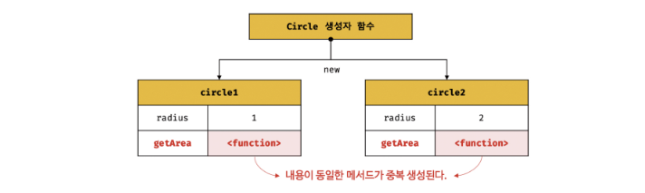
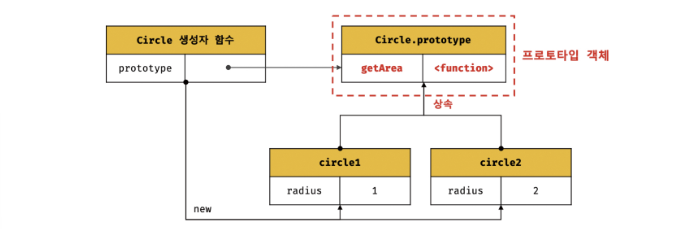
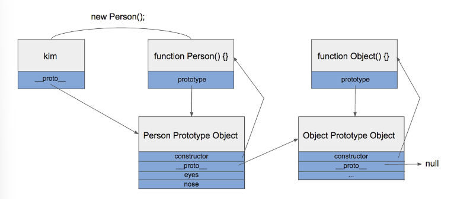
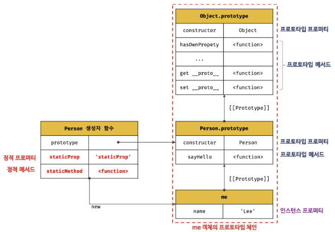

단 한줄의 코드를 작성했다고 가정

```javascript
function Person(name) 
{
  this.name = name;
}
```

자바스크립트 엔진이 이 코드를 읽는 순간

1. 건설사(함수)와 모델하우스(프로토타입) 동시 생성
   1. Person 함수 객체: 코드를 실행하는 역할을 할 '건설사'
   2. 텅 빈 객체 {}: Person 함수의 '모델하우스'로 사용될 객체

2. 두 객체 간의 링크 연결
   - 링크 1(prototype 속성): '건설사'(Person 함수)에게 prototype이라는 속성을 준다. 이 속성은 '모델하우스'(방금 만든 텅 빈 {} 객체)를 가리키게 한다

  ```text
    Person.prototype ---(참조)--> (모델하우스 객체{})
  ```

- 링크 2(constructor 속성): '모델하우스'({}객체)에게는 constrcutor이라는 속성은 준다. 이 속성은 '건설사'(Person 함수)를 가리키게 한다(모델하우스에 "이 집은 Person 건설사가 지었다"라는 명패를 붙이는것과 같다)

  ```text
    (모델하우스 객체{}).constrcutor ---(참조)---> Person 함수
  ```

  이 시점에선 Person.prototype이라는 '모델하우스'가 존재한다

3. 모델하우스에 기능 추가

4. '새 집'에 '모델하우스 주소'(proto)부여

나중에 개발자가 new Person('김')을 호출하면,

kim이라는 '새 집'(인스턴스)이 지어집니다.

이 '새 집'(kim)의 숨겨진 proto ('모델하우스 주소') 속성에

'건설사'(Person)가 들고 있던 prototype ('모델하우스')의 주소가 복사됩니다.

kim.__proto__는 Person.prototype을 가리키게 됩니다.

## 상속

어떤 객체의 프로퍼티 또는 메서드를 다른 객체가 상속받아 그대로 사용할 수 있는 것을 말한다
상속을 사용하는 이유는 불필요한 중복을 제거하여 개발 비용을 줄일 수 있다

```javascript
function Circle(radius) 
{
  this.radius = radius;
  this.getArea = function () 
  {
    return Math.PI * this.radius ** 2;
  };
}

const circle1 = new Circle(1);   //반지름이 1인 인스턴스 생성
const circle2 = new Circle(2);

//Circle 생성자 함수는 인스턴스를 생성할 때마다 동일한 동작을 하는
//getArea 메서드를 중복 생성하고 모든 인스턴스가 중복 소유한다
//getArea 메서드는 하나만 생성하여 모든 인스턴스가 공유해서 사용하는 것이 바람직하다

console.log(circle1.getArea === circle2.getArea);    // false
console.log(circle1.getArea());  // 3.14159...
console.log(circle2.getArea());  // 12.56637...
```



```javascript
function Circle(radius) {
  this.radius = radius;
}
// 모든 인스턴스가 getArea 메서드를 사용할 수 있도록 프로토타입에 추가한다.
// 프로토타입은 Circle 생성자 함수의 prototype 프로퍼티에 바인딩되어 있다.
Circle.prototype.getArea = function () {
  return Math.PI * this.radius ** 2;
};

const circle1 = new Circle(1);
const circle2 = new Circle(2);
// Circle 생성자 함수가 생성하는 모든 인스턴스는 하나의 getArea 메서드를 공유한다.
console.log(circle1.getArea === circle2.getArea);    // true
console.log(circle1.getArea());     // 3.14159...
console.log(circle2.getArea());     // 12.56637...
```



## proto 접근자 프로퍼티

proto란 prototype의 주소

모든 객체란 proto 접근자 프로퍼티를 통해 자신의 프로토타입, 즉 [[Prototype]] 내부 슬롯에 간접적으로 접근할 수 있다

```javascript
function Person() {}

Person.prototype.eyes = 2;
Person.prototype.nose = 1;

var kim = new Person();
var park = new Person();

console.log(kim.eyes); // => 2
```

kim에는 eyes라는 속성이 없는데도, kim.eyes를 실행하면 2라는 값을 참조하는 것을 볼 수 있습니다.
이것이 가능한 이유는 proto가 가능하게 한다

proto는 객체가 생성될 때 조상이었던 함수의 Prototype Object를 가리킨다

kim객체가 eyes를 직접 가지고 있지 않기 때문에 eyes 속성을 찾을 때 까지 상위 프로토타입을 탐색한다
최상위인 object의 Prototype object까지 도달했는데도 못찾았을 경우 undefined를 리턴한다

이렇게 proto 속성을 통해 상위 프로토타입과 연결되어있는 형태를 **프로토타입 체이닝**이라고 한다



그런데 [[Prototype]] 내부 슬롯의 값, 즉 프로토타입ㅔ 접근하기 위해 접근자 프로퍼티를 사용하는 이유는 상호 참조에 의해 프로토타입 체인이 생성되는 것을 방지하기 위해서이다

```javascript
const parert = {};
const child = {};

// child의 프로토타입을 parent로 설정
child.__proto__ = parent;
// parent 프로토타입을 child로 설정
parent.__proto__ = child;   // TypeError: Cyclic __proto__ value
```


프로토타입 체인은 무조건 단방향 linked list로 구현되어야한다
위 그림처럼 순환 참조하는 프로토타입 체인이 만들어지면 프로토타입 체인 종점이 존재하지않아 무한 루프에 빠진다

### proto를 직접 쓰지 않는 이유

1. 심각한 성능 저하
proto 접근자 프로퍼티로 객체의 프로토타입을 나중에 바꾸는 것은 자바스크립트 엔진에게 엄청나게 부담스러운 작업이다

   - 최적화 파괴: 자바스크립트 엔진은 객체가 처음 생성될 때, "이 객체의 '모델하우스'는 A이구나"라고 판단하고 그에 맞춰 모든 접근 경로를 최적화합니다
   - 그러나 중간에 '모델하우스'를 통째로 바꿔버린다면, 엔진은 기존에 최적화했던 모든 계산을 버리고 처음부터 다시 최적화를 해야하기때문이다

2. 비표준으로 시작
proto는 원래 자바스크립트 표준에 없던 기능이다

   - 과거 특정 브라우저에서 내부 [[Prototype]]에 접근하기위해 편의상 만든 비표준 속성이다
   - 하지만 표준 문서에는 이 기능은 구식이니 쓰라마라고 명시되어 있음

3. 더 안전하고 공식적인 방법이 존재한다

- 프로토타입을 읽을땐 Object.getPrototypeOf()
- 프로토타입을 지정해서 새 객체를 만들 땐 Object.create()를 사용

## 함수 객체의 prototype 프로퍼티

```text
함수 객체만이 소유하는 prototype 프로퍼티는
생성자 함수가 생성할 인스턴스의 프로토타입을 가리킨다
```

## 리터럴 객체의 생성자 함수와 프로토타입

1. 리터럴 객체의 생성자 함수는 **Object**이다

Object는 자바스크립트에 내장된 최상위 생성자 함수입니다

const obj = {}; 이코드는 const obj = new Object();의 단축 표현과 같다

- obj의 설계도 또는 출신이 Object라는 것을 의미한다
- 이 Object 함수 자체가 obj의 생성자 함수이다

```javascript
const obj = {};

// obj의 '건설사'는 Object 함수인가?
console.log(obj.constructor === Object); // true
```

2. 리터럴 객체의 프로토타입은 **Object.prototype**이다

Object.prototype은 자바스크립트에 내장된 최상위 프로토타입 객체이다

- 이 '모델하우스'에는 모든 객체가 공통으로 사용할 수 있는 메서드들이 보관되어있다
- const obj = {};로 객체를 만드는 순간, obj는 Object.prototype을 자신의 '원본 모델하우스'로 자동 상속받는다
- obj는 Object.prototype의 기능들을 빌려 쓸 수 있습니다

## 프로토타입의 생성 시점

자바스크립트에서 function 키워드로 함수를 선언하거나 함수 표현식으로 함수를 만들면,
자바스크립트 엔진은 그 즉시 두 가지를 생성한다

1. 함수 객체(ex. function Person() {}을 선언하면 Person이라는 함수 객체가 생긴다)
2. 해당 함수의 프로토타입 객체 (위 예시에서 Person.prototype이라는 객체가 동시에 생성된다)

이때 자바스크립트 엔진은 이 둘을 자동으로 연결해준다

- 생성된 Person.prototype 객체는 constructor라는 특별한 속성을 갖게 되어 이 속성은 다시
Person함수를 가리킨다 즉, Person.prototype.constructor === Person이다

```javascript
// 1. 함수를 '정의'하는 순간
function Person(name) {
  this.name = name;
}

// 2. 이 시점에 Person 함수 객체와
//    Person.prototype 객체가 이미 생성되어 있습니다.
console.log(Person.prototype);
// 출력: { constructor: f Person(name), __proto__: Object }

console.log(Person.prototype.constructor === Person);
// 출력: true
```

### 그렇다면 prototype은 언제 사용되는가?

프로토타입 객체는 생성 시점과 별개로, new 키워드를 사용해 새로운 객체를 생성할 때 사용된다

new Person('Alice')라는 코드가 실행되면 다음과 같은 일이 일어난다

1. 새로운 빈 객체가 생성된다
2. 이 새로운 객체의 내부 [[Prototype]] 링크(흔히 proto로 접근)가 Person.prototype객체를 가리키도록 설정된다
3. Person함수가 this를 이 새로운 객체로 바인딩하여 호출됩니다(그래서 this.gmae = name;이 동작한다)
4. 새로운 객체가 반환된다

결국 new를 통해 만들어진 모든 객체는 person.prototype을 자신의 원형 또는  부모로 삼게 되며
이를 통해 Person.prototype에 정의된 메서드나 속성을 공유할 수 있게 됩니다

참고: class와 화살표 함수

- class 키워드: ES6의 class 문법도 사실상 같다 선언하는 순간 person 생성자 함수와 prototype객체가 함께 생성된다. class는 이 과정을 좀 더 깔끔하게 포장한 문법적 설탕이다
- 화살표 함수: **매우 중요한 예외이다** 화살표 함수( () => {})는 prototype객체를 생성하지 않는다
애초에 new키워드로 객체를 생성하는 생성자로 설계되지 않았기 때문이다

## 프로퍼티 섀도잉

상속 관계에 의해 프로퍼티가 가려지는 현상을 프로퍼티 섀도잉이라고 한다 프로토타입 프로퍼티와 같은 이름의 프로퍼티를 객체에 추가하면 프로토타입 체인을 따라 프로토타입 프로퍼티를 검색해 프로토타입 프로퍼티를 덮어쓰는 것이 아니라 인스턴스 프로퍼티로 추가한다. 이때 인스턴스 메서드 sayHello는 프로토타입 메서드 sayHello를 오버라이딩했고 프로토타입 메서드 sayHello는 가려진다

## 오버라이딩

오버라이딩은 상위 클래스가 가지고 있는 메서드를 하위 클래스가 재정의하여 사용하는 방식이다 오버로딩은 함수의 이름은 동일하지만 매개변수의 타입이나 개수가 다른 메서드를 구현하고 매개변수에 의해 메서드를 구별하여 호출하는 방식이다

```javascript
const Person = (function () {
  // 생성자 함수
  function Person(name) {
    this.name = name;
  }
 
  // 프로토타입 메서드
  Person.prototype.sayHello = function () {
    console.log(`Hi! My name is ${this.name}`);
  };
 
  // 생성자 함수를 반환
  return Person;
}());
 
const me = new Person('Lee');
 
// 인스턴스 메서드
me.sayHello = function () {
  console.log(`Hey! My name is ${this.name}`);
};
 
// 인스턴스 메서드가 호출된다. 프로토타입 메서드는 인스턴스 메서드에 의해 가려진다.
me.sayHello(); // Hey! My name is Lee
```

### instanceof 연산자

a 객체가 저 b생성자의 인스턴스가 맞는지 확인하는 도구이다

객체 instanceof 생성자 형태로 사용하며, 결과는 true 또는 false로 나온다

실제 동작 원리: 프로토타입 체인 탐색

instanceof는 이 객체가 b로 만들어졌어?라고 단순히 묻는것이 아니다

alice instanceof Person 코드는 alice객체의 프로토타입체인 proto를 계속 따라가는 경로중에 Person.prototype객체와 ===일치하는 객체가 있는지 물어보는 것이다

### 직접 상속

#### Object.create에 의한 직접 상속

```javascript
// 프로토타입이 null인 객체를 생성한다. 생성된 객체는 프로토타입 체인의 종점에 위치한다.
// obj → null
let obj = Object.create(null);
console.log(Object.getPrototypeOf(obj) === null); // true
// Object.prototype을 상속받지 못한다.
console.log(obj.toString()); // TypeError: obj.toString is not a function
 
// obj → Object.prototype → null
// obj = {};와 동일하다.
obj = Object.create(Object.prototype);
console.log(Object.getPrototypeOf(obj) === Object.prototype); // true
 
// obj → Object.prototype → null
// obj = { x: 1 };와 동일하다.
obj = Object.create(Object.prototype, {
  x: { value: 1, writable: true, enumerable: true, configurable: true }
});
 
const myProto = { x: 10 };
// 임의의 객체를 직접 상속받는다.
// obj → myProto → Object.prototype → null
obj = Object.create(myProto);
console.log(obj.x); // 10
console.log(Object.getPrototypeOf(obj) === myProto); // true
 
// 생성자 함수
function Person(name) {
  this.name = name;
}
 
// obj → Person.prototype → Object.prototype → null
// obj = new Person('Lee')와 동일하다.
obj = Object.create(Person.prototype);
obj.name = 'Lee';
console.log(obj.name); // Lee
console.log(Object.getPrototypeOf(obj) === Person.prototype); // true
```

Object.create 메서드는 첫 번째 매개변수에 전달한 객체의 프로토타입 체인에 속하는 객체를 생성한다
첫 번째 매개변수에는 생성할 객체의 프로토타입으로 지정할 객체를 전달하고,
두 번째 매개변수에는 생성할 객체의 프로퍼티를 갖는 객체를 전달 할 수 있다

장점

1. new연산자 없이도 객체 생성가능
2. 프로토타입을 지정하면서 객체를 생성가능
3. 객체 리터럴에 의해 생성된 객체도 상속받을 수 있다

#### 객체 리터럴 내부에서 proto에 의한 직접 상속

```javascript
const myProto = { x: 10 };
 
// 객체 리터럴에 의해 객체를 생성하면서 프로토타입을 지정하여 직접 상속받을 수 있다.
const obj = {
  y: 20,
  // 객체를 직접 상속받는다.
  // obj → myProto → Object.prototype → null
  __proto__: myProto
};
 
console.log(obj.x, obj.y); // 10 20
console.log(Object.getPrototypeOf(obj) === myProto); // true
```

### 정적 프로퍼티 / 메서드



위 그림을 보면 정적 프로퍼티와 정적 메서드는 Person 생성자 함수의 일부이다 그러므로 다른 인스턴스를 생성할 필요없이 참조,호출가능하다
