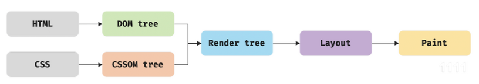

## 사전지식

1. 브라우저란?
사용자가 선택한 자원을 서버에 요청하고 브라우저에 표시하는 것
이때 자원은 HTML문서, PDF, 이미지 등 다양한 형태를 띌 수 있다 자원의주소는 URL에 의해 정해진다
2. 렌더링이란?
렌더링이란 서버로부터 HTML, CSS, JavaScript 등 작성한 파일을 받아 브라우저에 뿌려주는 것 즉, 브라우저에 시각적으로 출력하는 것
3. 파싱이란?
프로그래밍 언어의 문법에 맞게 작성된 텍스트문서를 읽어 실행하기 위해 텍스트 문서의 문자열을 토큰으로 분해하고, 토큰에 문법적 의미와 구조를 트리구조의 자료구조인 파스트리를 생성하는 일련의 과정
4. CSSOM(CSS Object Model)
CSS 스타일 규칙을 JavaScript에서 접근할 수 있도록 트리구조로 표현한 것
5. AST(Abstract Syntax Tree)
자바스크립트 코드의 구조를 트리 형태로 표현한 것

## 본격적인 과정

### 렌더링에 필요한 리소스를 서버에 요청하고 응답받기

브라우저는 HTML, CSS, 자바스크립트, 이미지, 폰트 파일 등 렌더링에 필요한 리소스를 서버에 요청하고 응답 받는다

렌더링에 필요한 모든소스는 서버에 존재하기 때문에 필요한 리소스를 서버에 요청하고, 서버가 응답한 리소스를 렌더링한다
브라우저의 렌더링 엔진이 html을 파싱하는 도중 외부 리소스를 로드하는 태그를 만나면 html 파싱을 일시 중단하고 해당 리소스 파일을 서버로 요청한다

### DOM 생성

html 문서는 문자열로 이루어진 순수한 텍스트기 때문에, 브라우저가 이해할 수 있는 자료구조(객체)로 변환하여 메모리로 저장해야 한다
서버는 브라우저가 요청한 HTML파일을 읽고 메모리에 저장한 다음, 메모리에 저장된 바이트를 인터넷을 경유하여 응답한다
응답된 바이트형태의 HTML 문서는 meta 태그의 charset 속성에 선언된 인코딩 방식이 응답 헤더에 담겨 브라우저가 이를 확인하고 문자열로 변환한다
문자열로 변환된 html 문서를 읽어 토큰으로 분해하고, 각 토큰을 객체로 변환하여 노드들을 생성하여 DOM을 구성하는 기본 요소가 된다
즉, html 요소 집합으로 이루어지며 중첩관계를 갖고 부자관계가 형성 되는데, 요소 각 부자 관계를 반영하여 모든 노드들을 트리 자료구조로 구성한 것이 DOM이다. 렌더링 엔진은 맨 윗줄부터 순차적으로 파싱하여 DOM을 생성한다

### CSSOM 생성

link태그를 만나면 DOM생성을 잠깐 멈추고 CSS 파일을 서버에 요청하여 HTML과 동일한 파싱과정을 거친다(바이트 -> 문자열 -> 토큰 -> 노드CSSOM) CSSOM생성을 마치면 다시 html 파싱이 중단된 지점부터 마저 파싱한다

### 렌더트리 생성

브라우저의 렌더링 엔진은 서버로부터 응답된 html과 css를 파싱하여 DOM과 CSSOM을 생성하여 결합해서 렌더트리를 생성한다

렌더트리란?
렌더트리는 렌더링을 위한 트리구조의 자료구조로, 브라우저 화면에 렌더링되는 노드만 구성해서 완성한다
브라우저 화면에 렌더링되지 않는 노드(meta, script 태그 등)와 CSS에 의해 표시되지 않는 노드는 렌더트리에 포함되지 않는다

완성된 렌더트리는 각 html 요소의 위치와 크기를 계산하는데 사용되고, 브라우저 화면에 픽셀을 렌더링하는 페인팅 처리에 입력된다

1. 자바스크립트의 의한 노드 추가 / 삭제
2. 브라우저 창의 리사이징에 의한 뷰포트 크기 변경
3. html요소의 레이아웃 크기 변경을 발생시키는 스타일 변경 등은 브라우저 렌더링 과정이 반복해서 실행될 수 있다 -> 계산과 페인팅을 다시 실행해야 하기 때문에 성능에 악영향을 준다

### 자바스크립트 파싱과 실행

DOM은 html 문서 구조 정보 및 DOM API를 제공한다 DOM API를 이용하면 이미 생성된 DOM을 동적으로 조작할 수 있다.

렌더링 엔진은 CSS 파싱과정과 마찬가지로 DOM을 만들다가 script태그를 만나면 일시중지하고 src속성에 정의된 파일을 서버에 요청하여 로드한 자바스크립트 파일이나 script 태그 내 자바스크립트 코드를 파싱하기 위해 자바스크립트 엔진에게 제어권을 넘긴다
자바스크립트 파싱과 실행이 종료되면 렌더링 엔진으로 다시 제어권을 넘기고, 일시중지되었던 html팡싱을 다시 시작하여 DOM 생성을 진행한다

### 자바스크립트 엔진

자바스크립트 엔진은 자바스크립트 코드를 파싱하여 CPU가 이해할 수 있는 저수준 언어로 변환하고 실행한다
렌더링 엔진으로부터 제어권을 넘겨받으면 자바스크립트 코드를 파싱하며 AST(추상적 구문트리)를 생성한다. AST를 기반으로 한 인터프리터가 시행할 수 있는 중간코드인 바이트 코드를 생성하여 실행한다
단순한 문자열인 자바스크립트 소스코드를 어휘분석하여 문법적 의미를 갖는 코드의 최소 단위인 토큰으로 분해한다(토크나이징)
토큰들의 집합을 구문 분석하여 AST를 생성한다. AST는 인터프리터가 실행할 수 있는 중간 코드인 바이트 코드를 변환되고 인터프리터에 의해 실행된다.
모든 자바스크립트 엔진은 ECMAScript 사양을 준수하며, V8(google chrom,e, node.js), SpiderMonkey(firefox), JavaScriptCore(safari) 등이 있다

### 리플로우와 리페인트

DOM APT가 사용되어 DOM이나 CSSOM이 변경되면 다시 렌더트리로 결합되고 변경된 렌더트리를 기반으로 레이아웃과 페인팅 과정을 거쳐 다시 브라우저 화면에 렌더링하는 과정을 리플로우, 리페인트라고 한다

리플로우는 레이아웃 계산을 다시 하는 것을 말하고, 노드 추가/삭제, 요소 크기/위치 변경, 윈도우 리사이징 등 레이아웃에 영향을 주는 변경이 발생한 경우에 한해 실행된다. 리페인트는 재결합된 렌더트리를 기반으로 다시 페인트 하는 것을 말한다
레이아웃에 영향이 없는 변경은 리플로우 없이 리페인트만 실행된다

1. HTML 파싱 ➔ DOM 트리 생성
브라우저가 HTML 파일을 위에서부터 한 줄씩 읽어 내려가며, '이 페이지가 어떤 구조로 되어 있는지' 파악합니다. 이 구조를 컴퓨터가 이해할 수 있는 **'DOM(Document Object Model) 트리'**라는 형태로 만듭니다.

예시: <body> 태그 안에 <h1>과 
가 있다면, DOM 트리에서 body 노드가 h1 노드와 p 노드를 자식으로 갖는 형태가 됩니다.

2. CSS 파싱 ➔ CSSOM 트리 생성
HTML을 파싱하다가 <link> 태그나 <style> 태그를 만나면, CSS 코드도 읽기 시작합니다. CSS 코드를 파싱해서 '각 요소에 어떤 스타일을 적용해야 하는지'에 대한 정보 맵을 만드는데, 이를 **'CSSOM(CSS Object Model) 트리'**라고 합니다.

예시: h1 { color: blue; }라는 코드가 있다면, CSSOM 트리는 'h1' 요소는 '파란색'이어야 한다는 정보를 갖게 됩니다.

3. 렌더 트리 생성 (DOM + CSSOM)
이제 브라우저는 DOM 트리(구조)와 CSSOM 트리(스타일)를 결합합니다. 이 결과물을 **'렌더 트리(Render Tree)'**라고 부릅니다.

중요: 렌더 트리는 실제로 화면에 보여질 요소들로만 구성됩니다.

만약 display: none; 스타일이 적용된 요소가 있다면, 그 요소는 렌더 트리에 포함되지 않습니다. (하지만 visibility: hidden;은 공간은 차지하므로 트리에 포함됩니다.)

4. 레이아웃 (Layout / Reflow)
렌더 트리가 만들어졌지만, 아직 각 요소가 '어디에, 얼마나 큰 크기로' 위치할지는 모릅니다. '레이아웃' 단계는 이 모든 요소의 크기와 위치를 뷰포트(화면) 기준으로 정확하게 계산하는 과정입니다.

h1 태그는 화면 상단에서 20px 떨어져 있고, 너비는 300px, 높이는 50px... 이런 식으로 페이지의 '설계도'를 그리는 단계입니다.

5. 페인트 (Paint)
'설계도'(레이아웃)가 완성되면, 이제 실제로 '색칠'을 할 차례입니다. '페인트' 단계는 각 요소를 실제 픽셀로 변환하는 과정입니다.

이 단계에서 '저 위치에 파란색 글씨', '이 위치에 검은색 테두리' 등을 그립니다.

이 작업은 여러 개의 '레이어(Layer)'로 나뉘어 처리될 수 있습니다. (포토샵 레이어처럼요.)

6. 합성 (Composite)
페인트 단계에서 생성된 여러 레이어들을 올바른 순서(예: z-index)대로 합쳐서 최종적으로 우리 눈에 보이는 하나의 화면을 만들어냅니다.

### 자바스크립트가 실행되는 순간?

1. 파싱 중단 (Parser-Blocking)
브라우저가 1번(HTML 파싱)을 진행하다가 <script> 태그를 만나면, 즉시 HTML 파싱을 멈춥니다.

2. 자바스크립트 실행
그리고는 바로 JS 파일을 다운로드하고, 파싱하고, 실행합니다.

3. 파싱 재개
JS 실행이 모두 끝나야 비로소 중단했던 지점부터 HTML 파싱(DOM 트리 생성)을 다시 시작합니다.

❓ 왜 멈추나요? 만약 JS 코드가 document.write("<h1>새 제목</h1>")처럼 DOM 구조를 변경하는 내용을 담고 있다면, 브라우저가 이미 만들어둔 DOM 트리가 쓸모없어지기 때문입니다. 그래서 브라우저는 "일단 JS부터 실행해서 페이지 구조가 바뀔지 아닐지 확인하고 넘어가자"라고 판단하는 것입니다.

이런 '파싱 중단' 특성은 페이지 로딩 속도에 큰 영향을 줍니다. 만약 용량이 큰 JS 파일이 <body> 상단에 있다면, 사용자는 JS가 모두 로드되고 실행될 때까지 빈 화면을 보게 될 수 있습니다.
