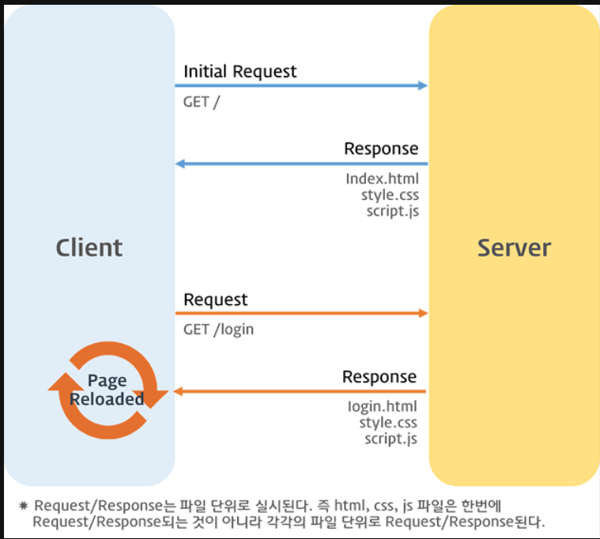
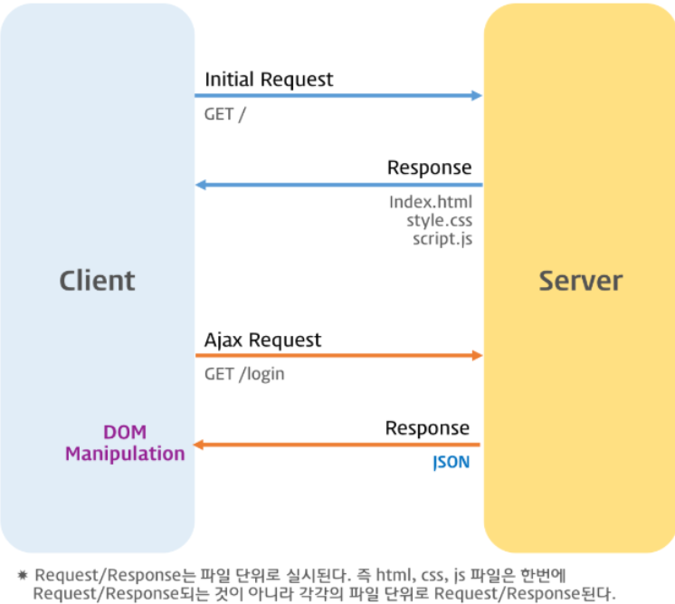

Ajax는 라이브러리같은 개념이 아니라 비동기 통신 기술이다

이전의 웹페이지는 html 태그로 시작해서 html태그로 끝나는 완전한 html을 서버로부터 전송받아 웹페이지 전체를 처음부터 다시 렌더링하는 방식으로 동작했다. 따라서 화면이 전환되면 서버로부터 새로운 HTML을 전송받아 웹페이지 전체를 다시 렌더링했다



이전 방식의 문제점

1. 이전 웹페이지와 차이가 없어서 변경할 필요가 없는 부분까지 포함된 완전한 HTML을 서버로부터 매번 전송받기 때문에 불필요한 데이터 통신이 발생한다.

2. 변경할 필요가 없는 부분까지 처음부터 다시 렌더링한다. 이로 인해 화면 전환이 일어나면 화면이 순간적으로 깜박이는 현상이 발생한다.

3. 클라이언트와 서버와의 통신이 동기 방식으로 동작하기 때문에 서버로부터 응답이 있을 때까지 다음 처리는 블로킹된다.



Ajax의 장점

1. 변경할 부분을 갱신하는 데 필요한 데이터만 서버로부터 전송받기 때문에 불필요한 데이터 통신이 발생하지 않는다.

2. 변경할 필요가 없는 부분은 다시 렌더링하지 않는다. 따라서 화면이 순간적으로 깜박이는 현상이 발생하지 않는다.

3. 클라이언트와 서버와의 통신이 비동기 방식으로 동작하기 때문에 서버에게 요청을 보낸 이후 블로킹이 발생하지 않는다

## JSON

JSON(JavaScript Object Notation)은 클라이언트와 서버 간의 HTTP 통신을 위한 텍스트 데이터 포맷이다. 자바스크립트에 종속되지 않는 언어 독립형 데이터 포맷으로, 대부분의 프로그래밍 언어에서 사용할 수 있다.

## XMLHttpRequest

브라우저는 주소창이나 HTML의 form 태그 또는 a 태그를 통해 HTTP 요청 전송 기능을 기본 제공한다. 자바스크립트를 사용하여 HTTP 요청을 전송하려면 XMLHttpRequest 객체를 사용한다. Web API인 XMLHttpRequest 객체는 HTTP 요청 전송과 HTTP 응답 수신을 위한 다양한 메서드와 프로퍼티를 제공한다.

XMLHttpRequest 객체 생성

```javascript
const xhr = new XMLHttpRequest();
```

## HTTP 요청 전송

1. XMLHttpRequest.prototype.open 메서드로 HTTP 요청을 초기화한다.

2. 필요에 따라 XMLHttpRequest.prototype.setRequestHeader 메서드로 특정 HTTP 요청의 헤더 값을 설정한다.

3. XMLHttpRequest.prototype.send 메서드로 HTTP 요청을 전송한다.

```javascript
// XMLHttpRequest 객체 생성
const xhr = new XMLHttpRequest();

// HTTP 요청 초기화
xhr.open('GET', '/users');

// HTTP 요청 헤더 설정
// 클라이언트가 서버로 전송할 데이터의 MIME 타입 지정: json
xhr.setRequestHeader('content-type', 'application/json');

// HTTP 요청 전송
xhr.send();
```
